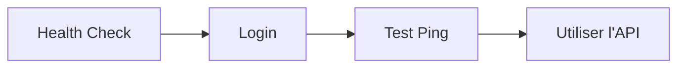
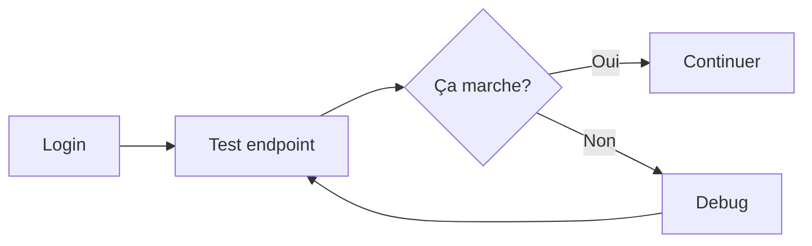

# 🚀 Collection Postman MCP Manager

## ⚡ Solution au problème CSRF

### Le Problème

Tu as rencontré l'erreur `CSRF token mismatch` avec l'endpoint `/login` car Laravel protège automatiquement toutes les routes web avec CSRF.

### ✅ La Solution

J'ai créé des **routes API spéciales** qui n'ont **PAS besoin de CSRF token** :

```
POST /api/postman/auth/register  ✅ Pas de CSRF
POST /api/postman/auth/login     ✅ Pas de CSRF
GET  /api/postman/auth/user      ✅ Pas de CSRF
POST /api/postman/auth/logout    ✅ Pas de CSRF
GET  /api/postman/health          ✅ Pas de CSRF
```

## 🎯 Quick Start (5 minutes)

### 1. Test que l'API fonctionne

```bash
curl http://localhost:3978/api/postman/health
```

Réponse attendue :
```json
{
  "status": "ok",
  "app": "Mcp manager",
  "environment": "local",
  "php_version": "8.4.1",
  "laravel_version": "12.16.0"
}
```

### 2. Se connecter (sans CSRF!)

**Dans Postman :**

```http
POST http://localhost:3978/api/postman/auth/login
Content-Type: application/json

{
  "email": "test@example.com",
  "password": "password",
  "remember": true
}
```

Réponse :
```json
{
  "message": "Login successful",
  "user": {
    "id": 1,
    "name": "Test User",
    "email": "test@example.com"
  },
  "note": "User authenticated..."
}
```

✅ **Postman stocke automatiquement le cookie de session**

### 3. Tester l'authentification

```http
GET http://localhost:3978/api/postman/test/ping
```

Réponse si authentifié :
```json
{
  "message": "pong",
  "user": {
    "id": 1,
    "name": "Test User",
    "email": "test@example.com"
  }
}
```

### 4. Utiliser les autres endpoints

Maintenant tu peux utiliser **tous les autres endpoints de l'API** :

```http
GET /api/integrations
GET /api/workflows
GET /api/notion/pages-tree
GET /api/jira/projects
POST /api/workflows
...
```

## 📁 Fichiers disponibles

| Fichier | Description |
|---------|-------------|
| `postman_collection.json` | Collection complète (138+ endpoints) |
| `postman_environment.json` | 🆕 Variables environnement **Local** |
| `postman_environment_staging.json` | 🆕 Variables environnement **Staging** |
| `postman_environment_production.json` | 🆕 Variables environnement **Production** |
| `POSTMAN_QUICK_START.md` | Guide détaillé de démarrage |
| `POSTMAN_CSRF_GUIDE.md` | Explications sur le CSRF |
| `POSTMAN_COLLECTION_README.md` | Documentation complète |
| `ENVIRONMENTS_GUIDE.md` | 🆕 Guide des environnements |

## 🔧 Configuration Postman

### Importer la collection

1. Ouvrir Postman
2. **Import** → Sélectionner `postman_collection.json`
3. **Import** → Sélectionner les 3 environnements :
   - `postman_environment.json` (Local)
   - `postman_environment_staging.json` (Staging)
   - `postman_environment_production.json` (Production)
4. Sélectionner l'environnement "MCP Manager - Local"

### 🌍 Environnements disponibles

Tu as maintenant **3 environnements** configurés :

| Environnement | URL | Usage |
|---------------|-----|-------|
| **Local** | `http://localhost:3978` | Développement quotidien ✅ |
| **Staging** | `https://staging.mcp-manager.com` | Tests pré-production 🔄 |
| **Production** | `https://api.mcp-manager.com` | Production ⚠️ |

**Pour changer d'environnement :**
- En haut à droite de Postman, menu déroulant
- Choisir l'environnement souhaité

📖 **Guide complet :** Consulte `ENVIRONMENTS_GUIDE.md` pour la configuration détaillée de chaque environnement.

### Ajouter les nouvelles routes

La collection existante contient déjà 138+ endpoints. Tu dois simplement ajouter un dossier au début avec les routes Postman :

**Créer un nouveau dossier "🚀 Postman API (No CSRF)"**

Ajouter ces requêtes :

1. **Health Check**
   - `GET {{base_url}}/api/postman/health`

2. **Register**
   - `POST {{base_url}}/api/postman/auth/register`
   - Body :
     ```json
     {
       "name": "John Doe",
       "email": "john@example.com",
       "password": "password123",
       "password_confirmation": "password123"
     }
     ```

3. **Login**
   - `POST {{base_url}}/api/postman/auth/login`
   - Body :
     ```json
     {
       "email": "test@example.com",
       "password": "password",
       "remember": true
     }
     ```

4. **Get User**
   - `GET {{base_url}}/api/postman/auth/user`

5. **Logout**
   - `POST {{base_url}}/api/postman/auth/logout`

6. **Test Ping**
   - `GET {{base_url}}/api/postman/test/ping`

7. **Test Integrations**
   - `GET {{base_url}}/api/postman/test/integrations`

## 📊 Workflow recommandé

### Pour les tests quotidiens



### Pour tester une nouvelle feature



## 🎨 Organisation de la collection

```
MCP Manager API/
├── 🚀 Postman API (No CSRF)         ⭐ NOUVEAU - Utiliser d'abord!
│   ├── Health Check
│   ├── Register
│   ├── Login
│   ├── Get User
│   ├── Logout
│   ├── Test Ping
│   └── Test Integrations
├── Authentication (7)
├── User Profile & Settings (4)
├── Integrations (5)
├── Notion (4)
├── Jira (27)
├── Git Integration (20)
├── Workflows (10)
├── MCP Server (8)
├── MCP Monitoring (5)
├── AI & Natural Language (4)
├── Daily Planning (3)
├── Admin (12)
└── Webhooks (2)
```

## 💡 Tips & Tricks

### 1. Vérifier les cookies

Dans Postman → **Cookies** tab → Tu devrais voir `laravel_session`

### 2. Tester rapidement

Créer un dossier "Quick Tests" avec :
- Health Check
- Login
- Test Ping

Exécuter tout le dossier d'un coup : **Run folder**

### 3. Variables utiles

Ajouter ces variables à l'environnement :

```
user_email = test@example.com
user_password = password
```

Utiliser dans les body :
```json
{
  "email": "{{user_email}}",
  "password": "{{user_password}}"
}
```

### 4. Scripts de test automatiques

Ajouter dans l'onglet "Tests" du login :

```javascript
// Sauvegarder l'user ID
var jsonData = pm.response.json();
if (jsonData.user && jsonData.user.id) {
    pm.environment.set('user_id', jsonData.user.id);
}

// Vérifier le succès
pm.test("Login successful", function () {
    pm.response.to.have.status(200);
    pm.expect(jsonData.message).to.include("successful");
});
```

## 🐛 Troubleshooting

### Erreur 401 "Not authenticated"

**Cause :** Pas de cookie de session

**Solution :**
1. Exécuter `POST /api/postman/auth/login`
2. Vérifier les cookies dans Postman
3. Réessayer

### Erreur 419 "CSRF token mismatch"

**Cause :** Tu utilises une route `/login` (web) au lieu de `/api/postman/auth/login` (API)

**Solution :**
✅ Utiliser `/api/postman/auth/login`
❌ Ne PAS utiliser `/login`

### Les cookies ne sont pas sauvegardés

**Cause :** Paramètres Postman

**Solution :**
1. Postman → Settings → General
2. ✅ Cocher "Automatically follow redirects"
3. ✅ Cocher "Retain headers when clicking on links"

### Le serveur ne répond pas

**Vérifier que Laravel tourne :**

```bash
php artisan serve --port=3978
```

## 📚 Documentation supplémentaire

- `POSTMAN_QUICK_START.md` - Guide complet étape par étape
- `POSTMAN_CSRF_GUIDE.md` - Comprendre le CSRF et les solutions
- `POSTMAN_COLLECTION_README.md` - Documentation de tous les endpoints

## ✅ Checklist avant de commencer

- [ ] Le serveur Laravel est démarré (`php artisan serve --port=3978`)
- [ ] La collection est importée dans Postman
- [ ] L'environnement "MCP Manager - Local" est sélectionné
- [ ] Health check fonctionne (`GET /api/postman/health`)
- [ ] Login fonctionne (`POST /api/postman/auth/login`)
- [ ] Les cookies sont activés dans Postman

## 🎉 C'est parti !

Tu es maintenant prêt à tester toute l'API sans te soucier du CSRF !

**Première requête à faire :**
```http
POST http://localhost:3978/api/postman/auth/login
Content-Type: application/json

{
  "email": "{{admin_email}}",
  "password": "{{admin_pwd}}"
}
```

(Utilise les credentials qui sont déjà dans les variables de collection)

---

**Questions ?** Consulte les guides dans ce dossier ou vérifie les logs Laravel :
```bash
tail -f storage/logs/laravel.log
```