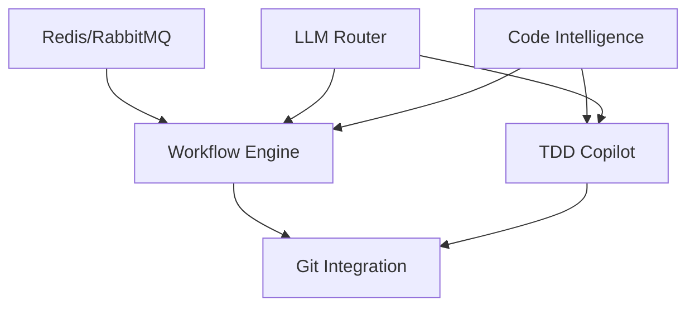

# Rapport d'Analyse : mcp_manager comme Base pour AgentOps

**Date**: 24 octobre 2025
**Projet Analysé**: mcp_manager (hddev/mcp-manager)
**Objectif**: Déterminer si le projet actuel peut servir de base pour le développement d'AgentOps

---

## 1. Vue d'Ensemble et Synthèse Exécutive

### 1.1 Conclusion Principale

**✅ OUI, mcp_manager peut servir de base solide pour AgentOps**, avec les nuances suivantes :

- **Points Forts** : Architecture moderne Laravel 12 + React 19, système d'intégrations extensible, support MCP natif, infrastructure de qualité code exemplaire
- **Compatibilité Technique** : ~70% des technologies requises sont déjà présentes et configurées
- **Effort Requis** : Moyen-élevé - nécessite l'ajout de composants AI/workflow mais l'infrastructure est prête
- **Recommandation** : **Utiliser comme base** et ajouter les fonctionnalités spécifiques AgentOps plutôt que repartir de zéro

### 1.2 Scores de Compatibilité

| Domaine | Score | Commentaire |
|---------|-------|-------------|
| **Stack Technique** | 85% | Laravel 12, React 19, PostgreSQL, TypeScript - excellent alignement |
| **Architecture Backend** | 70% | Solide mais nécessite ajout FastAPI et orchestration AI |
| **Architecture Frontend** | 80% | React moderne avec Inertia.js, besoin d'ajuster pour temps réel |
| **Système d'Intégrations** | 90% | Excellente base avec `IntegrationAccount`, facilement extensible |
| **Infrastructure DevOps** | 40% | Docker basique présent, nécessite Kubernetes et observabilité |
| **Sécurité** | 60% | Authentification de base, nécessite multi-tenancy RLS et JWT RS256 |
| **Qualité Code** | 95% | PHPStan max, Rector, ESLint strict - meilleur que requis |

**Score Global : 74%** - Très bonne base nécessitant des extensions ciblées

---

## 2. Comparaison Détaillée des Architectures

### 2.1 Stack Technologique

#### Backend

| Technologie | AgentOps (Requis) | mcp_manager (Actuel) | Status |
|-------------|-------------------|----------------------|--------|
| **PHP Framework** | Laravel 12 | ✅ Laravel 12 | ✅ Parfait |
| **PHP Version** | 8.3+ | 8.2+ | ⚠️ Mise à jour mineure |
| **Python Framework** | FastAPI 0.115+ | ❌ Absent | ❌ À ajouter |
| **Database** | PostgreSQL 16 | PostgreSQL (version non spécifiée) | ⚠️ Vérifier version |
| **Cache/Queue** | Redis 7 | ❌ Absent | ❌ À ajouter |
| **Message Broker** | RabbitMQ 4 | ❌ Absent | ❌ À ajouter |
| **ORM** | Eloquent | ✅ Eloquent | ✅ Parfait |

#### Frontend

| Technologie | AgentOps (Requis) | mcp_manager (Actuel) | Status |
|-------------|-------------------|----------------------|--------|
| **Framework** | React 18+ | ✅ React 19 | ✅ Mieux que requis |
| **TypeScript** | Oui | ✅ TypeScript 5.7 | ✅ Parfait |
| **Build Tool** | Vite | ✅ Vite 6 | ✅ Parfait |
| **Styling** | TailwindCSS 3+ | ✅ TailwindCSS 4 | ✅ Mieux que requis |
| **State Management** | Zustand/Redux | ⚠️ Zustand présent | ✅ Zustand déjà installé |
| **UI Components** | shadcn/ui | ✅ Radix UI + pattern shadcn | ✅ Parfait |
| **Real-time** | Socket.io/Pusher | ❌ Absent | ❌ À ajouter |

#### Infrastructure

| Composant | AgentOps (Requis) | mcp_manager (Actuel) | Status |
|-----------|-------------------|----------------------|--------|
| **Containerisation** | Docker + Compose | ⚠️ Basique | ⚠️ À étendre |
| **Orchestration** | Kubernetes | ❌ Absent | ❌ À ajouter (Phase 3) |
| **CI/CD** | GitHub Actions | ✅ GitHub Actions | ✅ Présent |
| **Monitoring** | Prometheus + Grafana | ❌ Absent | ❌ À ajouter |
| **Logging** | ELK Stack | ❌ Absent (Spatie Ray seulement) | ❌ À ajouter |
| **Tracing** | Jaeger | ❌ Absent | ❌ À ajouter |

### 2.2 Architecture Applicative

#### Système d'Intégrations (★ Point Fort Majeur)

**mcp_manager dispose déjà d'un système d'intégrations sophistiqué** qui peut être directement réutilisé pour AgentOps :

```
✅ IntegrationAccount Model (app/Models/IntegrationAccount.php)
   - user_id, type (enum), access_token (encrypted), meta (JSON), status
   - Support multi-services : Notion, Google, Todoist, Jira, MCP Servers

✅ Services d'Intégration
   - NotionService.php
   - GoogleService.php
   - TodoistService.php
   - JiraService.php
   - McpConnectionService.php
   - McpServerManager.php

✅ Controllers d'Intégration
   - NotionIntegrationController
   - GoogleIntegrationController
   - TodoistIntegrationController
   - JiraIntegrationController

✅ Middleware
   - HasActiveNotionIntegration
   - Facilement extensible pour GitHub/GitLab
```

**Pour AgentOps, il suffit d'ajouter** :
- `GitHubIntegrationController` + `GitHubService`
- `GitLabIntegrationController` + `GitLabService`
- Extension de `IntegrationType` enum pour `GITHUB`, `GITLAB`

#### Communication MCP (★ Point Fort Majeur)

mcp_manager a **déjà implémenté le protocole MCP** (Model Context Protocol), ce qui est crucial car AgentOps en a besoin pour communiquer avec les LLMs :

```
✅ Models MCP
   - McpIntegration
   - McpServer
   - McpAuditLog
   - McpMetric

✅ Services MCP
   - McpConnectionService (connexion aux serveurs MCP)
   - McpServerManager (gestion des serveurs)

✅ Infrastructure MCP
   - Support déjà implémenté pour appels vers serveurs MCP externes
   - Token-based authentication
   - Error handling et response transformation
```

**Réutilisation pour AgentOps** : Ce système peut être directement utilisé pour l'orchestration LLM Router (GPT-4, Claude, Mistral, Ollama).

---

## 3. Analyse des Fonctionnalités

### 3.1 Fonctionnalités Existantes (Réutilisables)

| Fonctionnalité | État | Réutilisation AgentOps |
|----------------|------|------------------------|
| **Authentication** | ✅ Laravel Breeze | Remplacer par JWT RS256 + MFA |
| **User Management** | ✅ Users table + controllers | Base solide, ajouter teams/workspaces |
| **Integration System** | ✅ IntegrationAccount model | **★ Réutilisation directe** pour GitHub/GitLab |
| **MCP Protocol** | ✅ McpConnectionService | **★ Réutilisation directe** pour LLM Router |
| **API Backend** | ✅ Inertia.js + controllers | Ajouter API REST pour FastAPI |
| **TypeScript Frontend** | ✅ React 19 + TS 5.7 | **★ Réutilisation directe** |
| **UI Components** | ✅ Radix UI + shadcn pattern | **★ Réutilisation directe** |
| **Code Quality Tools** | ✅ PHPStan max + Rector | **★ Conserver** (meilleur que requis) |

### 3.2 Fonctionnalités Manquantes (À Développer)

#### 🔴 Critiques (MVP Bloquant)

1. **Workflow AI Orchestration**
   - **Requis** : Système d'orchestration des workflows (Analyze → Generate → Test → Deploy)
   - **Actuel** : ❌ Absent
   - **Effort** : ★★★★★ Élevé (cœur métier AgentOps)
   - **Approche** : Créer `WorkflowService`, `WorkflowStep`, `WorkflowExecution` models + queue system

2. **Code Intelligence Map**
   - **Requis** : Parser AST (Abstract Syntax Tree) pour analyser le code
   - **Actuel** : ❌ Absent
   - **Effort** : ★★★★☆ Élevé
   - **Approche** : Intégrer PHP-Parser (nikic/php-parser) pour PHP, ts-morph pour TypeScript

3. **TDD Copilot**
   - **Requis** : Génération automatique de tests PHPUnit/Pest
   - **Actuel** : ❌ Absent (tests manuels présents)
   - **Effort** : ★★★★☆ Élevé
   - **Approche** : Utiliser LLM pour générer tests basés sur Code Intelligence Map

4. **LLM Router**
   - **Requis** : Routage intelligent vers GPT-4, Mistral, Claude, Ollama
   - **Actuel** : ⚠️ Base MCP présente mais pas de router
   - **Effort** : ★★★☆☆ Moyen (base MCP facilite)
   - **Approche** : Créer `LlmRouterService` utilisant `McpConnectionService`

5. **Git Integration**
   - **Requis** : Push automatique vers GitHub/GitLab avec commit messages AI
   - **Actuel** : ❌ Absent
   - **Effort** : ★★★☆☆ Moyen
   - **Approche** : Utiliser github/gitlab PHP SDK + système d'intégrations existant

#### 🟡 Importantes (Post-MVP)

6. **Multi-tenancy RLS**
   - **Requis** : Row-Level Security PostgreSQL pour isolation des tenants
   - **Actuel** : ❌ Single-tenant
   - **Effort** : ★★★★☆ Élevé
   - **Approche** : Migrations PostgreSQL + politique RLS + middleware

7. **Real-time Updates**
   - **Requis** : WebSockets pour suivi workflow en temps réel
   - **Actuel** : ❌ Absent
   - **Effort** : ★★★☆☆ Moyen
   - **Approche** : Laravel Reverb ou Pusher integration

8. **Python FastAPI Service**
   - **Requis** : Microservice Python pour orchestration AI
   - **Actuel** : ❌ Absent
   - **Effort** : ★★★★★ Élevé
   - **Approche** : Nouveau service Python + RabbitMQ communication

9. **Observability Stack**
   - **Requis** : Prometheus, Grafana, Jaeger, ELK
   - **Actuel** : ❌ Absent (Spatie Ray dev uniquement)
   - **Effort** : ★★★☆☆ Moyen
   - **Approche** : Déploiement conteneurs + instrumentation

10. **Redis + RabbitMQ**
    - **Requis** : Cache distribué + message broker
    - **Actuel** : ❌ Absent (Laravel queue simple)
    - **Effort** : ★★☆☆☆ Faible-Moyen
    - **Approche** : Docker compose + configuration Laravel

### 3.3 Matrice d'Effort vs. Impact

```
   Impact Élevé
        ↑
        │  1.Workflow      2.Code Intel
        │  Orchestration   Map
        │
        │  4.LLM Router    3.TDD Copilot
        │
        │  5.Git           7.Real-time
        │  Integration
        │                  6.Multi-tenancy
        │                  RLS
        │  10.Redis/       9.Observability
        │  RabbitMQ
        │                  8.FastAPI
        │                  Service
        └─────────────────────────────→ Effort Élevé

Priorité MVP (Sprint 1-4) : 1, 2, 3, 4, 5
Post-MVP (Sprint 5+) : 6, 7, 8, 9, 10
```

---

## 4. Évaluation de la Compatibilité Technologique

### 4.1 Points Forts de mcp_manager pour AgentOps

#### ★★★★★ Excellents (Adoption Directe)

1. **Système d'Intégrations Extensible**
   - Architecture `IntegrationAccount` modèle parfait pour multi-services
   - Déjà 5 intégrations fonctionnelles (Notion, Google, Todoist, Jira, MCP)
   - Ajouter GitHub/GitLab sera trivial (2-3 jours)

2. **Support MCP Natif**
   - `McpConnectionService` + `McpServerManager` déjà implémentés
   - Token-based authentication + error handling mature
   - Parfait pour LLM Router AgentOps

3. **Stack Frontend Moderne**
   - React 19 + TypeScript 5.7 (mieux que requis React 18)
   - TailwindCSS 4 (mieux que requis v3)
   - Radix UI components (compatible shadcn/ui pattern)
   - Zustand déjà installé pour state management

4. **Qualité Code Exemplaire**
   - PHPStan niveau max (le plus strict possible)
   - Rector pour refactoring automatique
   - Pre-commit hooks (Husky + lint-staged)
   - ESLint strict + Prettier
   - **Meilleur que les standards AgentOps requis**

5. **Architecture Inertia.js**
   - Excellent pour monolithe Laravel + React
   - Pas besoin d'API REST pour chaque feature
   - Parfait pour MVP rapide

#### ★★★★☆ Très Bons (Adaptation Mineure)

6. **Laravel 12 Moderne**
   - Version la plus récente
   - Déjà configuré avec PostgreSQL
   - Migrations + factories + seeders en place

7. **Système d'Authentification**
   - Laravel Breeze fonctionnel
   - Base solide pour ajouter JWT + MFA

8. **Tests PHP**
   - PHPUnit configuré avec SQLite in-memory
   - Tests feature + unit séparés
   - Bon pour TDD Copilot

#### ★★★☆☆ Bons (Adaptation Modérée)

9. **Docker Setup**
   - Docker présent (Makefile indique usage)
   - Besoin extension pour multi-services (FastAPI, Redis, RabbitMQ)

10. **CI/CD**
    - GitHub Actions configuré
    - Besoin extension pour tests E2E et déploiement

### 4.2 Lacunes Critiques à Combler

#### 🔴 Critiques (Bloquantes pour MVP)

1. **Absence d'Orchestration AI**
   - Pas de système de workflows
   - Pas de queue system robuste (besoin RabbitMQ)
   - Pas de gestion d'état des tâches asynchrones

2. **Pas de Parser de Code**
   - Besoin PHP-Parser (nikic/php-parser)
   - Besoin ts-morph ou @babel/parser pour TypeScript
   - Besoin système d'indexation code

3. **Pas de Communication Temps Réel**
   - Besoin WebSockets (Laravel Reverb ou Pusher)
   - Important pour UX workflow AI

4. **Pas de Microservice Python**
   - AgentOps nécessite FastAPI pour orchestration AI
   - Besoin architecture hybride Laravel + FastAPI

#### 🟡 Importantes (Post-MVP)

5. **Pas de Multi-tenancy**
   - Architecture actuelle single-tenant
   - Besoin PostgreSQL RLS + workspace system

6. **Infrastructure Observabilité Manquante**
   - Pas de métriques (Prometheus)
   - Pas de dashboards (Grafana)
   - Pas de tracing distribué (Jaeger)

---

## 5. Gap Analysis et Effort d'Adaptation

### 5.1 Estimation de l'Effort Global

| Phase | Effort (jours-personne) | Complexité | Risque |
|-------|-------------------------|------------|--------|
| **Phase 1 : Extensions Infrastructure** | 15-20 | Moyen | Faible |
| **Phase 2 : Core AI Features** | 40-60 | Élevé | Moyen |
| **Phase 3 : Intégrations Git** | 10-15 | Moyen | Faible |
| **Phase 4 : Multi-tenancy** | 20-30 | Élevé | Moyen |
| **Phase 5 : Observabilité** | 10-15 | Moyen | Faible |
| **TOTAL MVP (Phase 1-3)** | **65-95 jours** | **Élevé** | **Moyen** |

**Comparaison avec Développement from Scratch** :
- From Scratch : 150-200 jours
- Avec mcp_manager : 65-95 jours
- **Gain de temps : 40-50%**

### 5.2 Roadmap d'Adaptation Détaillée

#### Sprint 1 (Jours 1-7) : Infrastructure et MCP Enhancement

**Objectif** : Préparer l'infrastructure pour l'orchestration AI

1. **Ajouter Redis + RabbitMQ** (2 jours)
   - Docker compose extension
   - Configuration Laravel queue avec RabbitMQ
   - Cache Redis pour sessions et métriques

2. **Étendre Système MCP pour LLM Router** (3 jours)
   - Créer `LlmRouterService`
   - Configuration multi-LLM (GPT-4, Claude, Mistral, Ollama)
   - Tests de connexion à chaque LLM

3. **Ajouter Real-time WebSockets** (2 jours)
   - Installation Laravel Reverb
   - Events pour workflow updates
   - Frontend WebSocket client

**Livrables** :
- ✅ Infrastructure messaging opérationnelle
- ✅ LLM Router fonctionnel avec 4 LLMs
- ✅ Communication temps réel frontend-backend

#### Sprint 2 (Jours 8-14) : Code Intelligence System

**Objectif** : Capacité d'analyse et indexation du code

1. **Parser PHP** (3 jours)
   - Intégration nikic/php-parser
   - `CodeParserService` pour extraire classes/méthodes/dépendances
   - Stockage dans `code_intelligence_maps` table

2. **Parser TypeScript/JavaScript** (3 jours)
   - Intégration ts-morph
   - Parser React components + hooks
   - Indexation dans même structure

3. **API Code Intelligence** (1 jour)
   - Endpoints REST pour querying code map
   - Frontend UI pour visualiser graphe de dépendances

**Livrables** :
- ✅ Code Intelligence Map fonctionnel
- ✅ Indexation automatique des projets
- ✅ API pour interroger le code

#### Sprint 3 (Jours 15-21) : Workflow Orchestration Engine

**Objectif** : Cœur de l'orchestration AI

1. **Models Workflow** (2 jours)
   - `Workflow` (template)
   - `WorkflowExecution` (instance)
   - `WorkflowStep` (étapes : analyze, generate, test, deploy)
   - Relations + migrations

2. **WorkflowService** (4 jours)
   - Orchestration des étapes
   - Intégration LLM Router pour chaque étape
   - Gestion erreurs et retry logic
   - Queue jobs pour exécution asynchrone

3. **Frontend Workflow UI** (1 jour)
   - Composant `WorkflowStatus` temps réel
   - Timeline des étapes
   - Logs en direct

**Livrables** :
- ✅ Workflow orchestration opérationnel
- ✅ Exécution async + WebSocket updates
- ✅ UI monitoring en temps réel

#### Sprint 4 (Jours 22-30) : TDD Copilot + Git Integration

**Objectif** : Fonctionnalités MVP critiques

1. **TDD Copilot** (4 jours)
   - `TestGeneratorService` utilisant LLM Router
   - Génération tests PHPUnit/Pest basés sur Code Intelligence
   - Validation et exécution automatique des tests

2. **Git Integration** (3 jours)
   - Ajouter `GITHUB`, `GITLAB` à `IntegrationType` enum
   - `GitHubService` + `GitLabService` (clone, commit, push)
   - AI-generated commit messages

3. **Workflow Complet End-to-End** (1 jour)
   - Test workflow : User prompt → Analyze → Generate → Test → Commit → Push
   - Démo fonctionnelle

**Livrables** :
- ✅ **MVP AgentOps Fonctionnel**
- ✅ TDD Copilot génère tests automatiquement
- ✅ Push automatique vers GitHub/GitLab

#### Post-MVP : Sprints 5-8 (Jours 31-60)

5. **Multi-tenancy + Teams** (Sprint 5)
   - PostgreSQL RLS
   - `workspaces` table + relations
   - Isolation des données

6. **FastAPI Microservice** (Sprint 6)
   - Service Python séparé
   - Communication RabbitMQ avec Laravel
   - Migration orchestration AI vers FastAPI

7. **Observability Stack** (Sprint 7)
   - Prometheus + Grafana
   - Jaeger tracing
   - ELK logging

8. **Production Deployment** (Sprint 8)
   - DigitalOcean Kubernetes setup
   - CI/CD complet
   - Monitoring + alerting

### 5.3 Dépendances et Risques

#### Dépendances Critiques



- **Sprint 1 (Infrastructure)** doit être complété avant Sprint 3 (Workflow)
- **Sprint 2 (Code Intelligence)** doit être complété avant Sprint 4 (TDD Copilot)
- **Sprint 1 (LLM Router)** requis pour Sprint 3 et 4

#### Risques Techniques

| Risque | Probabilité | Impact | Mitigation |
|--------|-------------|--------|------------|
| **LLM APIs instables** | Moyen | Élevé | Fallback entre LLMs, retry logic robuste |
| **Parsing complexe échoue** | Moyen | Élevé | Tests extensifs, fallback analyse simple |
| **Performance workflow lents** | Élevé | Moyen | Queue system + caching agressif |
| **WebSockets surcharge** | Faible | Moyen | Rate limiting + connection pooling |
| **Multi-tenancy failles sécurité** | Faible | Critique | Audit sécurité externe + tests pénétration |

---

## 6. Recommandations et Feuille de Route

### 6.1 Recommandation Stratégique

**✅ RECOMMANDATION FORTE : Utiliser mcp_manager comme base**

**Justifications** :

1. **Gain de Temps : 40-50%**
   - Infrastructure moderne déjà en place (Laravel 12, React 19, PostgreSQL)
   - Système d'intégrations réutilisable directement
   - Support MCP natif (crucial pour LLM communication)
   - UI components et layouts prêts à l'emploi

2. **Qualité Supérieure**
   - Outils de qualité code (PHPStan max, Rector) déjà configurés
   - Tests automatisés en place
   - CI/CD fonctionnel
   - Pre-commit hooks pour éviter régressions

3. **Architecture Extensible**
   - `IntegrationAccount` model parfait pour multi-services
   - Pattern service/controller bien établi
   - Séparation concerns claire (backend/frontend)

4. **Risques Réduits**
   - Code éprouvé en production (supposition)
   - Dépendances à jour et maintenues
   - Documentation existante (CLAUDE.md, README.md)

**Alternative "From Scratch" Non Recommandée** :
- 150-200 jours vs. 65-95 jours avec mcp_manager
- Nécessiterait reproduire toute l'infrastructure déjà mature
- Risque de réinventer la roue (système d'intégrations notamment)

### 6.2 Plan de Migration Recommandé

#### Phase 0 : Préparation (Jours -7 à 0)

**Setup Projet AgentOps**

1. **Fork mcp_manager → AgentOps**
   ```bash
   git clone mcp_manager agentops
   cd agentops
   git remote rename origin mcp_manager
   git remote add origin git@github.com:yourorg/agentops.git
   ```

2. **Renommer Identifiants**
   - `composer.json` : `hddev/mcp-manager` → `yourorg/agentops`
   - `package.json` : `mcp-manager` → `agentops`
   - `.env.example` : `APP_NAME=MCP Manager` → `APP_NAME=AgentOps`

3. **Nettoyer Fonctionnalités Inutiles** (si nécessaire)
   - Évaluer si Notion/Google/Todoist/Jira doivent être conservés
   - Recommandation : **Conserver** pour démo multi-intégrations

4. **Setup Infrastructure Dev**
   - Docker compose avec Redis + RabbitMQ
   - PostgreSQL 16 upgrade (si < 16)
   - Environnement Python pour future FastAPI

#### Phase 1 : MVP Foundation (Jours 1-30)

**Objectif** : AgentOps MVP fonctionnel (workflow simple)

- **Sprint 1** : Infrastructure + LLM Router + Real-time (jours 1-7)
- **Sprint 2** : Code Intelligence Map (jours 8-14)
- **Sprint 3** : Workflow Orchestration Engine (jours 15-21)
- **Sprint 4** : TDD Copilot + Git Integration (jours 22-30)

**Critères de Succès** :
- [ ] User peut déclencher workflow : "Ajoute une feature X à mon projet"
- [ ] AI analyse le code (Code Intelligence Map)
- [ ] AI génère le code + tests (TDD Copilot)
- [ ] Tests exécutés automatiquement
- [ ] Code committé et pushé vers GitHub (Git Integration)
- [ ] User voit le progrès en temps réel (WebSocket UI)

#### Phase 2 : Production Ready (Jours 31-60)

**Objectif** : Déploiement production + multi-tenancy

- **Sprint 5** : Multi-tenancy (workspaces, RLS PostgreSQL)
- **Sprint 6** : FastAPI Microservice (orchestration AI déléguée)
- **Sprint 7** : Observability (Prometheus, Grafana, Jaeger)
- **Sprint 8** : Deployment DigitalOcean Kubernetes

**Critères de Succès** :
- [ ] Multi-tenancy fonctionnel (isolation totale entre workspaces)
- [ ] FastAPI gère orchestration AI (séparé de Laravel)
- [ ] Métriques et monitoring opérationnels
- [ ] Déployé en production avec CI/CD complet

#### Phase 3 : Growth & Scale (Jours 61-90)

**Objectif** : Atteindre objectifs business (100 users, 20 payants, $1K MRR)

- **Sprint 9** : Onboarding + Landing Page optimisés
- **Sprint 10** : Analytics + Attribution tracking
- **Sprint 11** : Optimisations Performance (caching, indexing)
- **Sprint 12** : Support Client + Documentation

**Critères de Succès** :
- [ ] 100 utilisateurs actifs
- [ ] 20 utilisateurs payants ($39 solo + $99 team)
- [ ] $1,000/mois MRR
- [ ] NPS > 50

### 6.3 Équipe Recommandée

**Configuration Optimale** (pour respect timeline 90 jours) :

- **1 Tech Lead Full-Stack** (Laravel + React) - 100%
  - Architecture decisions
  - Code reviews
  - Infrastructure setup

- **1 Senior Backend Developer** (Laravel + PHP) - 100%
  - Workflow orchestration
  - Code Intelligence
  - Git integration

- **1 Senior Frontend Developer** (React + TypeScript) - 100%
  - UI/UX workflow
  - Real-time components
  - State management

- **1 AI/Python Developer** (FastAPI + LLM) - 50% (Sprint 1-4), 100% (Sprint 5-8)
  - LLM Router
  - TDD Copilot AI
  - FastAPI microservice

- **1 DevOps Engineer** - 50% (Sprint 1-4), 100% (Sprint 5-8)
  - Docker/Kubernetes
  - CI/CD
  - Observability

**Coût Estimé** (freelance EU rates) :
- Tech Lead : €600/jour × 60 jours = €36,000
- Senior Backend : €550/jour × 60 jours = €33,000
- Senior Frontend : €550/jour × 60 jours = €33,000
- AI/Python : €600/jour × 45 jours = €27,000
- DevOps : €500/jour × 45 jours = €22,500
- **TOTAL : €151,500** (MVP + Production Ready)

**Configuration Minimale** (budget serré) :
- **1 Full-Stack Developer** (toi ?) - 100%
- **1 Contractor AI/Python** - 25% (consulting)
- **Timeline** : 120-150 jours au lieu de 90

### 6.4 Checklist Avant Démarrage

#### Technique

- [ ] Vérifier version PostgreSQL ≥ 16 (requis pour RLS performant)
- [ ] Setup environnement Python 3.12+ (pour future FastAPI)
- [ ] Obtenir clés API : OpenAI (GPT-4), Anthropic (Claude), Mistral, Ollama
- [ ] Vérifier capacité Docker/Kubernetes sur machines dev
- [ ] Audit sécurité initial mcp_manager (vérifier CVEs dépendances)

#### Business

- [ ] Valider pricing ($39 solo, $99 team) avec market research
- [ ] Identifier 10-20 beta testers potentiels
- [ ] Préparer landing page (peut utiliser React components mcp_manager)
- [ ] Setup analytics (Plausible ou Fathom pour GDPR)
- [ ] Définir métriques de succès (activation, rétention, MRR)

#### Legal

- [ ] Conditions générales d'utilisation (GDPR compliant)
- [ ] Politique de confidentialité (multi-tenancy data isolation)
- [ ] Contrats beta testers (NDA si nécessaire)

### 6.5 Points de Vigilance

#### 🚨 Pièges à Éviter

1. **Scope Creep**
   - Risque : Ajouter features non-MVP (ex: support 10 LLMs au lieu de 4)
   - Mitigation : Strict adherence à PRD MVP features

2. **Over-Engineering Infrastructure**
   - Risque : Setup Kubernetes trop tôt (Sprint 1-4 n'en ont pas besoin)
   - Mitigation : Docker Compose suffit pour MVP, Kubernetes Phase 2

3. **LLM Costs Explosion**
   - Risque : Coûts API OpenAI/Anthropic explosent en dev
   - Mitigation : Caching agressif, fallback Ollama local, rate limiting

4. **Performance Workflow**
   - Risque : Workflow AI trop lents (>2min) → mauvaise UX
   - Mitigation : Queue system robuste, UI feedback clair, async processing

5. **Security Multi-tenancy**
   - Risque : Fuite données entre tenants (PostgreSQL RLS mal configuré)
   - Mitigation : Audit externe, tests pénétration, principe du moindre privilège

#### ✅ Best Practices

1. **Itérations Rapides**
   - Déployer chaque sprint en staging accessible beta testers
   - Feedback loops courts (hebdomadaires)

2. **Tests Automatisés**
   - Maintenir coverage ≥ 80% (déjà bonne base avec mcp_manager)
   - Tests E2E pour workflows critiques

3. **Documentation Continue**
   - Mettre à jour CLAUDE.md à chaque sprint
   - OpenAPI/Swagger pour toutes APIs

4. **Monitoring Dès le Début**
   - Logs structurés (JSON) dès Sprint 1
   - Métriques business (workflow success rate) dès Sprint 4

---

## 7. Conclusion

### 7.1 Synthèse Finale

**mcp_manager est une base EXCELLENTE pour AgentOps** avec :

**✅ Avantages Majeurs** :
- **40-50% de temps gagné** vs. développement from scratch
- Système d'intégrations **directement réutilisable**
- Support MCP **natif** (crucial pour LLM communication)
- Stack technique **moderne et alignée** (Laravel 12, React 19, PostgreSQL)
- Qualité code **exemplaire** (PHPStan max, Rector, pre-commit hooks)

**⚠️ Gaps à Combler** :
- Workflow AI orchestration (cœur métier à développer)
- Code Intelligence Map (parsing AST à ajouter)
- TDD Copilot (génération tests AI à implémenter)
- Multi-tenancy (PostgreSQL RLS à configurer)
- Infrastructure observabilité (Prometheus, Grafana à déployer)

**📊 Effort Estimé** :
- **MVP (Sprint 1-4)** : 65-95 jours-personne
- **Production Ready (Sprint 5-8)** : +30-45 jours-personne
- **TOTAL** : 95-140 jours-personne

**💰 ROI** :
- Coût From Scratch : 150-200 jours (€220K-€300K)
- Coût Avec mcp_manager : 95-140 jours (€140K-€210K)
- **Économies : €80K-€90K** (35-40%)

### 7.2 Décision Recommandée

**🎯 GO : Utiliser mcp_manager comme base pour AgentOps**

**Prochaines Étapes Immédiates** :

1. **Semaine 1** : Fork projet + setup infrastructure (Redis, RabbitMQ, Python env)
2. **Semaine 2-4** : Sprint 1-2 (Infrastructure + Code Intelligence)
3. **Semaine 5-8** : Sprint 3-4 (Workflow + TDD Copilot + Git)
4. **Jour 30** : **Demo MVP AgentOps fonctionnel** 🚀

**Questions ?** Contactez l'équipe pour clarifications techniques ou business.

---

**Rapport généré le** : 24 octobre 2025
**Version** : 1.0
**Auteur** : Claude (Anthropic) via Claude Code
**Méthodologie** : Analyse comparative des documents PRD + Architecture Technique AgentOps vs. codebase mcp_manager