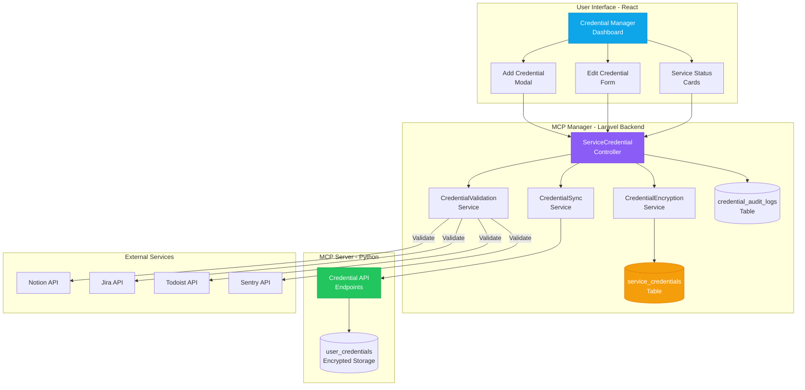

# Système de Gestion Centralisée des Credentials - MCP Manager

**Version:** 1.0
**Date:** 2025-11-01
**Auteurs:** Claude Code
**Status:** Architecture Design Document

---

## Table des Matières

1. [Vision et Objectifs](#1-vision-et-objectifs)
2. [Analyse de l'Existant](#2-analyse-de-lexistant)
3. [Architecture Proposée](#3-architecture-proposée)
4. [Schéma de Base de Données](#4-schéma-de-base-de-données)
5. [Système de Sécurité](#5-système-de-sécurité)
6. [API Backend (Laravel)](#6-api-backend-laravel)
7. [Interface Utilisateur (React)](#7-interface-utilisateur-react)
8. [Synchronisation avec MCP Server](#8-synchronisation-avec-mcp-server)
9. [Migration des Credentials Existants](#9-migration-des-credentials-existants)
10. [Plan d'Implémentation](#10-plan-dimplémentation)
11. [Tests et Validation](#11-tests-et-validation)
12. [Monitoring et Maintenance](#12-monitoring-et-maintenance)
13. [Appendices](#13-appendices)

---

## 1. Vision et Objectifs

### 1.1 Problématique Actuelle

Le système actuel présente des **limitations critiques** :

❌ **Gestion fragmentée** - Credentials stockés dans le MCP Server uniquement
❌ **Pas d'interface utilisateur** - Configuration via API ou fichiers .env
❌ **Sécurité limitée** - Base64 encoding au lieu d'encryption réelle
❌ **Mono-compte** - Un seul credential par service pour les services non-OAuth
❌ **Pas d'audit trail** - Logging incomplet pour la plupart des services
❌ **Validation tardive** - Credentials testés uniquement à l'utilisation
❌ **Expérience utilisateur pauvre** - Aucune UI pour gérer ses accès

### 1.2 Vision de la Nouvelle Architecture

✅ **Gestion centralisée dans MCP Manager** - Source de vérité pour tous les credentials
✅ **Interface utilisateur moderne** - UI React pour gérer facilement ses credentials
✅ **Sécurité renforcée** - AES-256-GCM encryption avec gestion de clés robuste
✅ **Multi-compte** - Support de multiples credentials par service et par utilisateur
✅ **Audit trail complet** - Tracking de toutes les opérations sur les credentials
✅ **Validation proactive** - Test de validité avant stockage
✅ **Expérience utilisateur optimale** - Gestion self-service intuitive

### 1.3 Services Supportés

| Service | Type d'Auth | Champs Requis | Multi-Compte | Validation |
|---------|-------------|---------------|--------------|------------|
| **Notion** | API Token | `token` | ✅ | Test API databases |
| **Jira** | API Token | `url`, `email`, `token` | ✅ | Test API myself |
| **Todoist** | API Token | `token` | ✅ | Test API sync |
| **Sentry** | API Token | `token`, `org_slug` | ✅ | Test API projects |
| **Confluence** | API Token | `url`, `email`, `token` | ✅ | Test API content |
| **Gmail** | OAuth2 | `access_token`, `refresh_token` | ✅ | OAuth flow |
| **Google Calendar** | OAuth2 | `access_token`, `refresh_token` | ✅ | OAuth flow |
| **OpenAI** | API Key | `api_key`, `model` | ❌ | Test API models |
| **Anthropic** | API Key | `api_key`, `model` | ❌ | Test API messages |
| **Mistral** | API Key | `api_key` | ❌ | Test API chat |

### 1.4 Bénéfices Clés

**Pour les Utilisateurs :**
- 🎯 Gestion self-service de leurs credentials
- 🔒 Visibilité complète sur les accès accordés
- ⚡ Validation instantanée des credentials
- 📊 Historique des modifications et accès
- 🔄 Révocation facile en cas de problème

**Pour les Administrateurs :**
- 👁️ Visibilité sur tous les credentials de l'organisation
- 🛡️ Contrôle d'accès granulaire par service
- 📈 Métriques d'utilisation des services
- 🚨 Alertes sur les credentials expirés ou invalides
- 📝 Audit trail complet pour compliance

**Pour le Système :**
- 🏗️ Architecture découplée et scalable
- 🔐 Sécurité renforcée (AES-256-GCM)
- 🔄 Synchronisation bi-directionnelle avec MCP Server
- 🧪 Tests automatisés de validité
- 📊 Monitoring et observabilité

---

## 2. Analyse de l'Existant

### 2.1 Architecture Actuelle (MCP Server)

```
┌─────────────────────────────────────────────────────────────┐
│                      MCP SERVER (Python)                     │
│                                                              │
│  ┌────────────────────────────────────────────────────┐     │
│  │  Configuration Modes:                              │     │
│  │                                                     │     │
│  │  1. Standalone Mode (.env files)                   │     │
│  │     └─► Credentials partagés pour tous            │     │
│  │                                                     │     │
│  │  2. Managed Mode (MCP Manager API)                │     │
│  │     └─► Credentials délégués au Manager          │     │
│  │         └─► ⚠️  Base64 encoding uniquement       │     │
│  └────────────────────────────────────────────────────┘     │
│                                                              │
│  ┌────────────────────────────────────────────────────┐     │
│  │  Database Tables:                                  │     │
│  │  • oauth_tokens (Google - AES-256 encrypted)      │     │
│  │  • oauth_multi_accounts (Multi Google accounts)   │     │
│  │  • token_audit_logs (Audit trail for OAuth only)  │     │
│  └────────────────────────────────────────────────────┘     │
│                                                              │
│  ❌ Limitations:                                            │
│  • Pas de CRUD UI pour credentials                         │
│  • Base64 pour MCP Manager (pas sécurisé)                  │
│  • Mono-credential pour services non-OAuth                 │
│  • Audit incomplet                                         │
└─────────────────────────────────────────────────────────────┘
```

### 2.2 État Actuel de IntegrationAccount (Laravel)

**Table existante :** `integration_accounts`

```php
Schema::create('integration_accounts', function (Blueprint $table) {
    $table->id();
    $table->foreignId('user_id')->constrained()->cascadeOnDelete();
    $table->string('type'); // 'notion', 'todoist', 'gmail', etc.
    $table->text('access_token'); // Encrypted
    $table->text('refresh_token')->nullable();
    $table->timestamp('expires_at')->nullable();
    $table->json('meta')->nullable();
    $table->string('status')->default('active');
    $table->timestamps();
});
```

**Problèmes :**
- ❌ Un seul credential par user+type (pas multi-compte)
- ❌ Pas de champs spécifiques par service (JIRA url, Sentry org_slug, etc.)
- ❌ Pas de validation des credentials
- ❌ Pas d'audit trail des modifications
- ❌ Metadata JSON non structuré

---

## 3. Architecture Proposée

### 3.1 Nouvelle Architecture Centralisée



### 3.2 Flux de Données : Ajout de Credential

```mermaid
sequenceDiagram
    participant User as Utilisateur<br/>(Browser)
    participant UI as React UI
    participant API as Laravel API
    participant Validator as Validation<br/>Service
    participant Service as External<br/>Service
    participant DB as PostgreSQL
    participant MCP as MCP Server

    User->>UI: Click "Add Notion Credential"
    UI->>User: Show credential form
    User->>UI: Enter token + name
    UI->>API: POST /api/credentials<br/>{service: 'notion', token: '...'}
    activate API

    API->>Validator: validateCredential('notion', data)
    activate Validator
    Validator->>Service: GET /v1/databases (test)
    activate Service

    alt Credential Valid
        Service-->>Validator: 200 OK + databases list
        deactivate Service
        Validator-->>API: ✅ Credential valid
        deactivate Validator

        API->>API: Encrypt credential (AES-256-GCM)
        API->>DB: INSERT service_credentials<br/>{encrypted data}
        DB-->>API: Credential saved (id: 123)

        API->>DB: INSERT credential_audit_logs<br/>{action: created}

        par Sync to MCP Server
            API->>MCP: POST /credentials<br/>{service, encrypted_token}
            MCP-->>API: Credential synced
        end

        API-->>UI: 201 Created<br/>{id, service, name, status}
        UI-->>User: ✅ "Notion credential added"
    else Credential Invalid
        Service-->>Validator: 401 Unauthorized
        deactivate Service
        Validator-->>API: ❌ Invalid token
        deactivate Validator
        API-->>UI: 422 Validation Error
        UI-->>User: ❌ "Invalid Notion token"
    end
    deactivate API
```

### 3.3 Responsabilités par Couche

| Couche | Responsabilités |
|--------|-----------------|
| **React UI** | • Formulaires de saisie<br/>• Validation côté client<br/>• Affichage status en temps réel<br/>• Gestion erreurs UX |
| **Laravel API** | • CRUD credentials<br/>• Orchestration validation<br/>• Encryption/Decryption<br/>• Permissions & Authorization<br/>• Audit logging |
| **Validation Service** | • Test credentials avec services réels<br/>• Parsing réponses API<br/>• Rate limiting<br/>• Retry logic |
| **Encryption Service** | • AES-256-GCM encryption<br/>• Key rotation<br/>• Secure key storage |
| **Sync Service** | • Synchronisation bi-directionnelle<br/>• Gestion conflits<br/>• Retry failed syncs |
| **Database** | • Stockage encrypted<br/>• Indexing pour performance<br/>• Audit trail |
| **MCP Server** | • Stockage secondaire encrypted<br/>• Utilisation credentials pour intégrations<br/>• Token refresh (OAuth) |

---

## 4. Schéma de Base de Données

### 4.1 Table Principale : `service_credentials`

**Objectif :** Stockage sécurisé de tous les credentials utilisateurs

```sql
CREATE TABLE service_credentials (
    id BIGINT UNSIGNED AUTO_INCREMENT PRIMARY KEY,
    user_id BIGINT UNSIGNED NOT NULL,
    service_type VARCHAR(50) NOT NULL COMMENT 'notion, jira, todoist, etc.',
    credential_name VARCHAR(100) NOT NULL COMMENT 'User-friendly name',

    -- Encrypted credential data
    encrypted_data TEXT NOT NULL COMMENT 'AES-256-GCM encrypted JSON',
    encryption_key_version INT NOT NULL DEFAULT 1 COMMENT 'For key rotation',

    -- Service-specific metadata
    service_metadata JSON NULL COMMENT 'Service-specific fields (url, org_slug, etc.)',

    -- OAuth specific
    access_token_encrypted TEXT NULL COMMENT 'Encrypted access token (OAuth)',
    refresh_token_encrypted TEXT NULL COMMENT 'Encrypted refresh token (OAuth)',
    token_expires_at TIMESTAMP NULL,
    oauth_scopes TEXT NULL,

    -- Status and validation
    status ENUM('active', 'inactive', 'invalid', 'expired', 'revoked') NOT NULL DEFAULT 'active',
    last_validated_at TIMESTAMP NULL,
    validation_error TEXT NULL,
    last_used_at TIMESTAMP NULL,
    use_count INT UNSIGNED DEFAULT 0,

    -- Multi-account support
    is_primary BOOLEAN DEFAULT FALSE COMMENT 'Primary credential for this service',
    account_identifier VARCHAR(255) NULL COMMENT 'Email, username, or unique ID',

    -- Sync with MCP Server
    mcp_credential_id VARCHAR(36) NULL COMMENT 'UUID in MCP Server',
    sync_status ENUM('pending', 'synced', 'error', 'out_of_sync') DEFAULT 'pending',
    last_synced_at TIMESTAMP NULL,
    sync_error TEXT NULL,

    -- Audit
    created_at TIMESTAMP DEFAULT CURRENT_TIMESTAMP,
    updated_at TIMESTAMP DEFAULT CURRENT_TIMESTAMP ON UPDATE CURRENT_TIMESTAMP,
    created_by BIGINT UNSIGNED NULL COMMENT 'Admin who created (if not self)',
    updated_by BIGINT UNSIGNED NULL,

    FOREIGN KEY (user_id) REFERENCES users(id) ON DELETE CASCADE,
    FOREIGN KEY (created_by) REFERENCES users(id) ON DELETE SET NULL,
    FOREIGN KEY (updated_by) REFERENCES users(id) ON DELETE SET NULL,

    -- Indexes
    INDEX idx_user_service (user_id, service_type),
    INDEX idx_user_service_primary (user_id, service_type, is_primary),
    INDEX idx_status (status),
    INDEX idx_sync_status (sync_status),
    INDEX idx_last_validated (last_validated_at),
    INDEX idx_token_expiry (token_expires_at),
    UNIQUE KEY unique_user_service_name (user_id, service_type, credential_name)
) ENGINE=InnoDB DEFAULT CHARSET=utf8mb4 COLLATE=utf8mb4_unicode_ci;
```

### 4.2 Table : `credential_audit_logs`

**Objectif :** Audit trail complet de toutes les opérations sur credentials

```sql
CREATE TABLE credential_audit_logs (
    id BIGINT UNSIGNED AUTO_INCREMENT PRIMARY KEY,
    credential_id BIGINT UNSIGNED NULL COMMENT 'Can be NULL if credential deleted',
    user_id BIGINT UNSIGNED NULL,
    service_type VARCHAR(50) NOT NULL,

    -- Action tracking
    action ENUM(
        'created', 'updated', 'deleted', 'validated',
        'used', 'revoked', 'synced', 'sync_failed',
        'refreshed', 'expired', 'invalidated'
    ) NOT NULL,

    -- Change tracking
    old_values JSON NULL COMMENT 'Previous values (excluding credentials)',
    new_values JSON NULL COMMENT 'New values (excluding credentials)',

    -- Metadata
    performed_by BIGINT UNSIGNED NULL COMMENT 'Who performed the action',
    ip_address VARCHAR(45) NULL,
    user_agent TEXT NULL,

    -- Result
    success BOOLEAN DEFAULT TRUE,
    error_message TEXT NULL,

    -- Context
    context JSON NULL COMMENT 'Additional context (API endpoint used, etc.)',

    created_at TIMESTAMP DEFAULT CURRENT_TIMESTAMP,

    FOREIGN KEY (credential_id) REFERENCES service_credentials(id) ON DELETE SET NULL,
    FOREIGN KEY (user_id) REFERENCES users(id) ON DELETE SET NULL,
    FOREIGN KEY (performed_by) REFERENCES users(id) ON DELETE SET NULL,

    INDEX idx_credential (credential_id),
    INDEX idx_user_action (user_id, action),
    INDEX idx_action_created (action, created_at),
    INDEX idx_service_action (service_type, action)
) ENGINE=InnoDB DEFAULT CHARSET=utf8mb4 COLLATE=utf8mb4_unicode_ci;
```

### 4.3 Table : `service_configurations`

**Objectif :** Configuration globale par service (rate limits, validation rules, etc.)

```sql
CREATE TABLE service_configurations (
    id BIGINT UNSIGNED AUTO_INCREMENT PRIMARY KEY,
    service_type VARCHAR(50) NOT NULL UNIQUE,

    -- Display
    display_name VARCHAR(100) NOT NULL,
    description TEXT NULL,
    icon_url VARCHAR(255) NULL,
    documentation_url VARCHAR(255) NULL,

    -- Authentication
    auth_type ENUM('api_token', 'api_key', 'oauth2', 'basic_auth') NOT NULL,
    required_fields JSON NOT NULL COMMENT 'Array of required field names',
    optional_fields JSON NULL,

    -- Validation
    validation_enabled BOOLEAN DEFAULT TRUE,
    validation_endpoint VARCHAR(255) NULL COMMENT 'API endpoint for validation',
    validation_method VARCHAR(10) DEFAULT 'GET',
    validation_timeout INT DEFAULT 10 COMMENT 'Seconds',

    -- Features
    supports_multi_account BOOLEAN DEFAULT TRUE,
    supports_token_refresh BOOLEAN DEFAULT FALSE,
    supports_revocation BOOLEAN DEFAULT TRUE,

    -- Rate Limiting
    rate_limit_per_minute INT NULL,
    rate_limit_per_hour INT NULL,

    -- Status
    is_enabled BOOLEAN DEFAULT TRUE,
    is_beta BOOLEAN DEFAULT FALSE,

    created_at TIMESTAMP DEFAULT CURRENT_TIMESTAMP,
    updated_at TIMESTAMP DEFAULT CURRENT_TIMESTAMP ON UPDATE CURRENT_TIMESTAMP,

    INDEX idx_enabled (is_enabled),
    INDEX idx_auth_type (auth_type)
) ENGINE=InnoDB DEFAULT CHARSET=utf8mb4 COLLATE=utf8mb4_unicode_ci;
```

### 4.4 Structure Encrypted Data (JSON)

**Format du champ `encrypted_data` après déchiffrement :**

```json
{
  "notion": {
    "token": "secret_xxxxxxxxxxxxxxxxxxxx",
    "workspace_id": "abc123def456",
    "workspace_name": "My Workspace"
  },

  "jira": {
    "url": "https://mycompany.atlassian.net",
    "email": "user@example.com",
    "api_token": "ATATTxxxxxxxxxxxxx",
    "cloud_id": "abc-123-def-456"
  },

  "todoist": {
    "token": "xxxxxxxxxxxxxxxxxxxx",
    "user_id": "12345678"
  },

  "sentry": {
    "token": "xxxxxxxxxxxxxxxxxxxxx",
    "org_slug": "my-organization",
    "project_slugs": ["backend", "frontend"]
  },

  "gmail": {
    "email": "user@gmail.com",
    "access_token": "ya29.xxxxxxxxxxxx",
    "refresh_token": "1//xxxxxxxxxxxx",
    "expires_at": "2025-11-01T15:30:00Z",
    "scopes": ["gmail.readonly", "gmail.send"]
  }
}
```

---

## 5. Système de Sécurité

### 5.1 Encryption : AES-256-GCM

**Méthode choisie :** AES-256 en mode GCM (Galois/Counter Mode)

**Avantages :**
- ✅ Authenticated encryption (AEAD)
- ✅ Détection de tampering
- ✅ Performance excellente
- ✅ Support natif Laravel (OpenSSL)
- ✅ Standard industriel (NIST approved)

**Implémentation Laravel :**

```php
namespace App\Services\Encryption;

use Illuminate\Support\Facades\Crypt;

class CredentialEncryptionService
{
    private string $currentKeyVersion = '1';

    /**
     * Encrypt credential data with AES-256-GCM
     */
    public function encrypt(array $credentialData): array
    {
        $json = json_encode($credentialData);

        // Using Laravel's Crypt facade (AES-256-CBC by default)
        // For GCM, we need to use OpenSSL directly
        $ivLength = openssl_cipher_iv_length('aes-256-gcm');
        $iv = random_bytes($ivLength);
        $tag = '';

        $encrypted = openssl_encrypt(
            $json,
            'aes-256-gcm',
            base64_decode(config('app.credential_key')),
            OPENSSL_RAW_DATA,
            $iv,
            $tag,
            '', // Additional authenticated data (AAD)
            16  // Tag length
        );

        // Combine IV + Ciphertext + Tag
        $combined = base64_encode($iv . $encrypted . $tag);

        return [
            'encrypted_data' => $combined,
            'encryption_key_version' => $this->currentKeyVersion,
        ];
    }

    /**
     * Decrypt credential data
     */
    public function decrypt(string $encryptedData, int $keyVersion = 1): array
    {
        $decoded = base64_decode($encryptedData);

        $ivLength = openssl_cipher_iv_length('aes-256-gcm');
        $tagLength = 16;

        $iv = substr($decoded, 0, $ivLength);
        $tag = substr($decoded, -$tagLength);
        $ciphertext = substr($decoded, $ivLength, -$tagLength);

        $decrypted = openssl_decrypt(
            $ciphertext,
            'aes-256-gcm',
            base64_decode($this->getKey($keyVersion)),
            OPENSSL_RAW_DATA,
            $iv,
            $tag
        );

        if ($decrypted === false) {
            throw new \RuntimeException('Decryption failed - data may be corrupted or tampered');
        }

        return json_decode($decrypted, true);
    }

    /**
     * Get encryption key by version (for key rotation)
     */
    private function getKey(int $version): string
    {
        return match($version) {
            1 => config('app.credential_key'),
            2 => config('app.credential_key_v2'),
            default => throw new \InvalidArgumentException("Unknown key version: {$version}"),
        };
    }

    /**
     * Rotate encryption key for a credential
     */
    public function rotateKey(ServiceCredential $credential): void
    {
        $decrypted = $this->decrypt(
            $credential->encrypted_data,
            $credential->encryption_key_version
        );

        $this->currentKeyVersion = '2';
        $reencrypted = $this->encrypt($decrypted);

        $credential->update([
            'encrypted_data' => $reencrypted['encrypted_data'],
            'encryption_key_version' => 2,
        ]);
    }
}
```

### 5.2 Key Management

**Configuration :** `.env`

```bash
# Primary encryption key (Base64 encoded 256-bit key)
APP_CREDENTIAL_KEY=base64:xxxxxxxxxxxxxxxxxxxxxxxxxxxxxxxxxxxxxxxxxxxx

# Key rotation - future key
APP_CREDENTIAL_KEY_V2=

# Key generation command
php artisan credential:generate-key
```

**Artisan Command :** `credential:generate-key`

```php
namespace App\Console\Commands;

use Illuminate\Console\Command;

class GenerateCredentialKeyCommand extends Command
{
    protected $signature = 'credential:generate-key
                          {--show : Display the key instead of modifying files}
                          {--force : Force the operation to run in production}';

    protected $description = 'Generate a new credential encryption key';

    public function handle(): int
    {
        $key = 'base64:'.base64_encode(random_bytes(32)); // 256-bit key

        if ($this->option('show')) {
            $this->line('<comment>'.$key.'</comment>');
            return self::SUCCESS;
        }

        if (! $this->option('force') && app()->environment('production')) {
            $this->error('Key generation in production requires --force flag');
            return self::FAILURE;
        }

        $this->setKeyInEnvironmentFile($key);
        $this->info('Credential encryption key generated successfully');

        return self::SUCCESS;
    }

    private function setKeyInEnvironmentFile(string $key): void
    {
        $envPath = app()->environmentFilePath();
        $envContent = file_get_contents($envPath);

        if (str_contains($envContent, 'APP_CREDENTIAL_KEY=')) {
            $envContent = preg_replace(
                '/APP_CREDENTIAL_KEY=.*/m',
                'APP_CREDENTIAL_KEY='.$key,
                $envContent
            );
        } else {
            $envContent .= "\nAPP_CREDENTIAL_KEY=".$key."\n";
        }

        file_put_contents($envPath, $envContent);
    }
}
```

### 5.3 Permissions et Authorization

**Policy :** `ServiceCredentialPolicy`

```php
namespace App\Policies;

use App\Models\User;
use App\Models\ServiceCredential;

class ServiceCredentialPolicy
{
    /**
     * Determine if user can view their own credentials
     */
    public function viewAny(User $user): bool
    {
        return true; // All authenticated users can view their own
    }

    /**
     * Determine if user can view a specific credential
     */
    public function view(User $user, ServiceCredential $credential): bool
    {
        // Own credentials or admin
        return $user->id === $credential->user_id
            || $user->hasPermission('credentials.view_all');
    }

    /**
     * Determine if user can create credentials
     */
    public function create(User $user): bool
    {
        return $user->isActive() && ! $user->isLocked();
    }

    /**
     * Determine if user can update a credential
     */
    public function update(User $user, ServiceCredential $credential): bool
    {
        return $user->id === $credential->user_id
            || $user->hasPermission('credentials.edit_all');
    }

    /**
     * Determine if user can delete a credential
     */
    public function delete(User $user, ServiceCredential $credential): bool
    {
        return $user->id === $credential->user_id
            || $user->hasPermission('credentials.delete_all');
    }

    /**
     * Determine if user can view decrypted credential (sensitive operation)
     */
    public function viewDecrypted(User $user, ServiceCredential $credential): bool
    {
        // Only the owner can view decrypted credentials
        // Even admins cannot see others' credentials
        return $user->id === $credential->user_id;
    }
}
```

### 5.4 Rate Limiting

**Middleware :** `ThrottleCredentialValidation`

```php
namespace App\Http\Middleware;

use Closure;
use Illuminate\Http\Request;
use Illuminate\Support\Facades\RateLimiter;

class ThrottleCredentialValidation
{
    public function handle(Request $request, Closure $next, int $maxAttempts = 10)
    {
        $key = 'credential-validation:'.$request->user()->id;

        if (RateLimiter::tooManyAttempts($key, $maxAttempts)) {
            $seconds = RateLimiter::availableIn($key);

            return response()->json([
                'message' => "Too many validation attempts. Try again in {$seconds} seconds.",
            ], 429);
        }

        RateLimiter::hit($key, 60); // 1 minute decay

        $response = $next($request);

        return $response->header(
            'X-RateLimit-Remaining',
            RateLimiter::remaining($key, $maxAttempts)
        );
    }
}
```

**Routes :**

```php
Route::middleware(['auth', ThrottleCredentialValidation::class.':10'])
    ->post('/credentials/validate', [ServiceCredentialController::class, 'validate']);
```

---

## 6. API Backend (Laravel)

### 6.1 Model : `ServiceCredential`

```php
namespace App\Models;

use App\Services\Encryption\CredentialEncryptionService;
use Illuminate\Database\Eloquent\Model;
use Illuminate\Database\Eloquent\Relations\BelongsTo;

class ServiceCredential extends Model
{
    protected $fillable = [
        'user_id',
        'service_type',
        'credential_name',
        'encrypted_data',
        'encryption_key_version',
        'service_metadata',
        'access_token_encrypted',
        'refresh_token_encrypted',
        'token_expires_at',
        'oauth_scopes',
        'status',
        'last_validated_at',
        'validation_error',
        'last_used_at',
        'use_count',
        'is_primary',
        'account_identifier',
        'mcp_credential_id',
        'sync_status',
        'last_synced_at',
        'sync_error',
        'created_by',
        'updated_by',
    ];

    protected $casts = [
        'service_metadata' => 'array',
        'token_expires_at' => 'datetime',
        'last_validated_at' => 'datetime',
        'last_used_at' => 'datetime',
        'last_synced_at' => 'datetime',
        'is_primary' => 'boolean',
        'use_count' => 'integer',
    ];

    protected $hidden = [
        'encrypted_data',
        'access_token_encrypted',
        'refresh_token_encrypted',
    ];

    // Relationships

    public function user(): BelongsTo
    {
        return $this->belongsTo(User::class);
    }

    public function createdBy(): BelongsTo
    {
        return $this->belongsTo(User::class, 'created_by');
    }

    public function updatedBy(): BelongsTo
    {
        return $this->belongsTo(User::class, 'updated_by');
    }

    // Accessors & Mutators

    /**
     * Get decrypted credential data
     */
    public function getDecryptedDataAttribute(): array
    {
        if (! $this->encrypted_data) {
            return [];
        }

        $encryptionService = app(CredentialEncryptionService::class);

        return $encryptionService->decrypt(
            $this->encrypted_data,
            $this->encryption_key_version
        );
    }

    /**
     * Set credential data (will be encrypted)
     */
    public function setCredentialData(array $data): void
    {
        $encryptionService = app(CredentialEncryptionService::class);
        $encrypted = $encryptionService->encrypt($data);

        $this->encrypted_data = $encrypted['encrypted_data'];
        $this->encryption_key_version = $encrypted['encryption_key_version'];
    }

    // Scopes

    public function scopeActive($query)
    {
        return $query->where('status', 'active');
    }

    public function scopeForService($query, string $serviceType)
    {
        return $query->where('service_type', $serviceType);
    }

    public function scopePrimary($query)
    {
        return $query->where('is_primary', true);
    }

    public function scopeExpiringSoon($query, int $hours = 24)
    {
        return $query->where('token_expires_at', '<=', now()->addHours($hours))
                    ->where('token_expires_at', '>', now());
    }

    public function scopeNeedsValidation($query, int $days = 7)
    {
        return $query->where(function ($q) use ($days) {
            $q->whereNull('last_validated_at')
              ->orWhere('last_validated_at', '<', now()->subDays($days));
        });
    }

    // Helper Methods

    public function isExpired(): bool
    {
        return $this->token_expires_at && $this->token_expires_at->isPast();
    }

    public function markAsUsed(): void
    {
        $this->increment('use_count');
        $this->update(['last_used_at' => now()]);
    }

    public function markAsValidated(bool $valid = true, ?string $error = null): void
    {
        $this->update([
            'last_validated_at' => now(),
            'status' => $valid ? 'active' : 'invalid',
            'validation_error' => $error,
        ]);
    }

    public function revoke(): void
    {
        $this->update(['status' => 'revoked']);

        // Log audit
        CredentialAuditLog::create([
            'credential_id' => $this->id,
            'user_id' => $this->user_id,
            'service_type' => $this->service_type,
            'action' => 'revoked',
            'performed_by' => auth()->id(),
        ]);
    }
}
```

### 6.2 Controller : `ServiceCredentialController`

```php
namespace App\Http\Controllers;

use App\Http\Requests\StoreServiceCredentialRequest;
use App\Http\Requests\UpdateServiceCredentialRequest;
use App\Models\ServiceCredential;
use App\Services\CredentialValidationService;
use App\Services\CredentialSyncService;
use Illuminate\Http\JsonResponse;
use Illuminate\Http\Request;
use Inertia\Inertia;
use Inertia\Response;

class ServiceCredentialController extends Controller
{
    public function __construct(
        protected CredentialValidationService $validationService,
        protected CredentialSyncService $syncService
    ) {}

    /**
     * Display credentials dashboard
     */
    public function index(Request $request): Response
    {
        $credentials = $request->user()
            ->serviceCredentials()
            ->with(['createdBy', 'updatedBy'])
            ->latest()
            ->get()
            ->groupBy('service_type');

        $serviceConfigs = ServiceConfiguration::where('is_enabled', true)->get();

        return Inertia::render('Credentials/Index', [
            'credentials' => $credentials,
            'serviceConfigs' => $serviceConfigs,
            'stats' => [
                'total' => $request->user()->serviceCredentials()->count(),
                'active' => $request->user()->serviceCredentials()->active()->count(),
                'expired' => $request->user()->serviceCredentials()->where('status', 'expired')->count(),
                'services_connected' => $request->user()->serviceCredentials()->distinct('service_type')->count(),
            ],
        ]);
    }

    /**
     * Store a new credential
     */
    public function store(StoreServiceCredentialRequest $request): JsonResponse
    {
        $validated = $request->validated();

        // Validate credential with external service
        $validationResult = $this->validationService->validate(
            $validated['service_type'],
            $validated['credential_data']
        );

        if (! $validationResult['valid']) {
            return response()->json([
                'message' => 'Invalid credential',
                'error' => $validationResult['error'],
            ], 422);
        }

        // Create credential
        $credential = new ServiceCredential([
            'user_id' => $request->user()->id,
            'service_type' => $validated['service_type'],
            'credential_name' => $validated['name'],
            'service_metadata' => $validated['metadata'] ?? [],
            'account_identifier' => $validationResult['account_identifier'] ?? null,
            'status' => 'active',
            'last_validated_at' => now(),
            'created_by' => $request->user()->id,
        ]);

        $credential->setCredentialData($validated['credential_data']);

        // Set as primary if it's the first for this service
        $existingCount = $request->user()
            ->serviceCredentials()
            ->forService($validated['service_type'])
            ->count();

        if ($existingCount === 0) {
            $credential->is_primary = true;
        }

        $credential->save();

        // Sync to MCP Server (async)
        $this->syncService->syncCredentialToMcp($credential);

        // Log audit
        CredentialAuditLog::create([
            'credential_id' => $credential->id,
            'user_id' => $credential->user_id,
            'service_type' => $credential->service_type,
            'action' => 'created',
            'performed_by' => $request->user()->id,
            'new_values' => [
                'name' => $credential->credential_name,
                'account' => $credential->account_identifier,
            ],
        ]);

        return response()->json([
            'message' => 'Credential created successfully',
            'credential' => $credential->load(['createdBy']),
        ], 201);
    }

    /**
     * Validate a credential without storing it
     */
    public function validate(Request $request): JsonResponse
    {
        $request->validate([
            'service_type' => ['required', 'string'],
            'credential_data' => ['required', 'array'],
        ]);

        $result = $this->validationService->validate(
            $request->service_type,
            $request->credential_data
        );

        return response()->json($result);
    }

    /**
     * Update an existing credential
     */
    public function update(UpdateServiceCredentialRequest $request, ServiceCredential $credential): JsonResponse
    {
        $this->authorize('update', $credential);

        $validated = $request->validated();
        $oldValues = [
            'name' => $credential->credential_name,
            'status' => $credential->status,
        ];

        // If credential data is being updated, validate it
        if (isset($validated['credential_data'])) {
            $validationResult = $this->validationService->validate(
                $credential->service_type,
                $validated['credential_data']
            );

            if (! $validationResult['valid']) {
                return response()->json([
                    'message' => 'Invalid credential',
                    'error' => $validationResult['error'],
                ], 422);
            }

            $credential->setCredentialData($validated['credential_data']);
            $credential->last_validated_at = now();
            $credential->status = 'active';
            $credential->validation_error = null;
        }

        // Update other fields
        $credential->fill([
            'credential_name' => $validated['name'] ?? $credential->credential_name,
            'service_metadata' => $validated['metadata'] ?? $credential->service_metadata,
            'updated_by' => $request->user()->id,
        ]);

        $credential->save();

        // Sync to MCP Server
        $this->syncService->syncCredentialToMcp($credential);

        // Log audit
        CredentialAuditLog::create([
            'credential_id' => $credential->id,
            'user_id' => $credential->user_id,
            'service_type' => $credential->service_type,
            'action' => 'updated',
            'performed_by' => $request->user()->id,
            'old_values' => $oldValues,
            'new_values' => [
                'name' => $credential->credential_name,
                'status' => $credential->status,
            ],
        ]);

        return response()->json([
            'message' => 'Credential updated successfully',
            'credential' => $credential->fresh()->load(['updatedBy']),
        ]);
    }

    /**
     * Delete a credential
     */
    public function destroy(Request $request, ServiceCredential $credential): JsonResponse
    {
        $this->authorize('delete', $credential);

        // If it's the primary, check if we need to promote another
        if ($credential->is_primary) {
            $nextPrimary = $request->user()
                ->serviceCredentials()
                ->forService($credential->service_type)
                ->where('id', '!=', $credential->id)
                ->active()
                ->first();

            if ($nextPrimary) {
                $nextPrimary->update(['is_primary' => true]);
            }
        }

        // Log before deletion
        CredentialAuditLog::create([
            'credential_id' => $credential->id,
            'user_id' => $credential->user_id,
            'service_type' => $credential->service_type,
            'action' => 'deleted',
            'performed_by' => $request->user()->id,
            'old_values' => [
                'name' => $credential->credential_name,
                'account' => $credential->account_identifier,
            ],
        ]);

        // Delete from MCP Server
        $this->syncService->deleteCredentialFromMcp($credential);

        $credential->delete();

        return response()->json([
            'message' => 'Credential deleted successfully',
        ]);
    }

    /**
     * Set a credential as primary for its service
     */
    public function setPrimary(Request $request, ServiceCredential $credential): JsonResponse
    {
        $this->authorize('update', $credential);

        // Unset current primary
        $request->user()
            ->serviceCredentials()
            ->forService($credential->service_type)
            ->update(['is_primary' => false]);

        // Set new primary
        $credential->update(['is_primary' => true]);

        return response()->json([
            'message' => 'Primary credential updated',
            'credential' => $credential->fresh(),
        ]);
    }

    /**
     * Re-validate a credential
     */
    public function revalidate(Request $request, ServiceCredential $credential): JsonResponse
    {
        $this->authorize('update', $credential);

        $decryptedData = $credential->decrypted_data;

        $result = $this->validationService->validate(
            $credential->service_type,
            $decryptedData
        );

        $credential->markAsValidated($result['valid'], $result['error'] ?? null);

        // Log audit
        CredentialAuditLog::create([
            'credential_id' => $credential->id,
            'user_id' => $credential->user_id,
            'service_type' => $credential->service_type,
            'action' => 'validated',
            'performed_by' => $request->user()->id,
            'success' => $result['valid'],
            'error_message' => $result['error'] ?? null,
        ]);

        return response()->json([
            'message' => $result['valid'] ? 'Credential is valid' : 'Credential is invalid',
            'valid' => $result['valid'],
            'error' => $result['error'] ?? null,
            'credential' => $credential->fresh(),
        ], $result['valid'] ? 200 : 422);
    }
}
```

### 6.3 Service : `CredentialValidationService`

**Objectif :** Valider les credentials avec les services externes réels

```php
namespace App\Services;

use Illuminate\Support\Facades\Http;
use Illuminate\Support\Facades\Log;

class CredentialValidationService
{
    private const TIMEOUT = 10; // seconds

    /**
     * Validate a credential for a given service
     */
    public function validate(string $serviceType, array $credentialData): array
    {
        return match($serviceType) {
            'notion' => $this->validateNotion($credentialData),
            'jira' => $this->validateJira($credentialData),
            'todoist' => $this->validateTodoist($credentialData),
            'sentry' => $this->validateSentry($credentialData),
            'confluence' => $this->validateConfluence($credentialData),
            'openai' => $this->validateOpenAI($credentialData),
            'anthropic' => $this->validateAnthropic($credentialData),
            'mistral' => $this->validateMistral($credentialData),
            default => ['valid' => false, 'error' => 'Unsupported service type'],
        };
    }

    /**
     * Validate Notion credential
     */
    private function validateNotion(array $data): array
    {
        try {
            $response = Http::timeout(self::TIMEOUT)
                ->withHeaders([
                    'Authorization' => 'Bearer '.$data['token'],
                    'Notion-Version' => '2022-06-28',
                ])
                ->get('https://api.notion.com/v1/databases', [
                    'page_size' => 1,
                ]);

            if ($response->successful()) {
                $user = $response->json('results.0.created_by');

                return [
                    'valid' => true,
                    'account_identifier' => $user['id'] ?? null,
                    'metadata' => [
                        'workspace_name' => $response->json('workspace_name'),
                    ],
                ];
            }

            return [
                'valid' => false,
                'error' => 'Invalid Notion token: '.$response->json('message', 'Unknown error'),
            ];
        } catch (\Exception $e) {
            Log::error('Notion validation failed', [
                'error' => $e->getMessage(),
            ]);

            return [
                'valid' => false,
                'error' => 'Validation failed: '.$e->getMessage(),
            ];
        }
    }

    /**
     * Validate Jira credential
     */
    private function validateJira(array $data): array
    {
        try {
            $response = Http::timeout(self::TIMEOUT)
                ->withBasicAuth($data['email'], $data['api_token'])
                ->get($data['url'].'/rest/api/3/myself');

            if ($response->successful()) {
                $user = $response->json();

                return [
                    'valid' => true,
                    'account_identifier' => $user['emailAddress'],
                    'metadata' => [
                        'display_name' => $user['displayName'],
                        'account_id' => $user['accountId'],
                    ],
                ];
            }

            return [
                'valid' => false,
                'error' => 'Invalid Jira credentials: '.$response->json('errorMessages.0', 'Unknown error'),
            ];
        } catch (\Exception $e) {
            return [
                'valid' => false,
                'error' => 'Validation failed: '.$e->getMessage(),
            ];
        }
    }

    /**
     * Validate Todoist credential
     */
    private function validateTodoist(array $data): array
    {
        try {
            $response = Http::timeout(self::TIMEOUT)
                ->withToken($data['token'])
                ->get('https://api.todoist.com/sync/v9/sync', [
                    'sync_token' => '*',
                    'resource_types' => '["user"]',
                ]);

            if ($response->successful()) {
                $user = $response->json('user');

                return [
                    'valid' => true,
                    'account_identifier' => $user['email'],
                    'metadata' => [
                        'full_name' => $user['full_name'],
                        'user_id' => $user['id'],
                    ],
                ];
            }

            return [
                'valid' => false,
                'error' => 'Invalid Todoist token',
            ];
        } catch (\Exception $e) {
            return [
                'valid' => false,
                'error' => 'Validation failed: '.$e->getMessage(),
            ];
        }
    }

    /**
     * Validate Sentry credential
     */
    private function validateSentry(array $data): array
    {
        try {
            $response = Http::timeout(self::TIMEOUT)
                ->withToken($data['token'])
                ->get("https://sentry.io/api/0/organizations/{$data['org_slug']}/projects/");

            if ($response->successful()) {
                $projects = $response->json();

                return [
                    'valid' => true,
                    'account_identifier' => $data['org_slug'],
                    'metadata' => [
                        'projects_count' => count($projects),
                        'project_slugs' => array_column($projects, 'slug'),
                    ],
                ];
            }

            return [
                'valid' => false,
                'error' => 'Invalid Sentry token or organization',
            ];
        } catch (\Exception $e) {
            return [
                'valid' => false,
                'error' => 'Validation failed: '.$e->getMessage(),
            ];
        }
    }

    /**
     * Validate Confluence credential
     */
    private function validateConfluence(array $data): array
    {
        try {
            $response = Http::timeout(self::TIMEOUT)
                ->withBasicAuth($data['email'], $data['api_token'])
                ->get($data['url'].'/wiki/rest/api/user/current');

            if ($response->successful()) {
                $user = $response->json();

                return [
                    'valid' => true,
                    'account_identifier' => $user['email'],
                    'metadata' => [
                        'display_name' => $user['displayName'],
                        'account_id' => $user['accountId'],
                    ],
                ];
            }

            return [
                'valid' => false,
                'error' => 'Invalid Confluence credentials',
            ];
        } catch (\Exception $e) {
            return [
                'valid' => false,
                'error' => 'Validation failed: '.$e->getMessage(),
            ];
        }
    }

    /**
     * Validate OpenAI API key
     */
    private function validateOpenAI(array $data): array
    {
        try {
            $response = Http::timeout(self::TIMEOUT)
                ->withToken($data['api_key'])
                ->get('https://api.openai.com/v1/models');

            if ($response->successful()) {
                return [
                    'valid' => true,
                    'account_identifier' => null,
                    'metadata' => [
                        'models_count' => count($response->json('data', [])),
                    ],
                ];
            }

            return [
                'valid' => false,
                'error' => 'Invalid OpenAI API key',
            ];
        } catch (\Exception $e) {
            return [
                'valid' => false,
                'error' => 'Validation failed: '.$e->getMessage(),
            ];
        }
    }

    /**
     * Validate Anthropic API key
     */
    private function validateAnthropic(array $data): array
    {
        try {
            // Anthropic doesn't have a validation endpoint, so we make a minimal request
            $response = Http::timeout(self::TIMEOUT)
                ->withHeaders([
                    'x-api-key' => $data['api_key'],
                    'anthropic-version' => '2023-06-01',
                ])
                ->post('https://api.anthropic.com/v1/messages', [
                    'model' => $data['model'] ?? 'claude-3-haiku-20240307',
                    'max_tokens' => 1,
                    'messages' => [
                        ['role' => 'user', 'content' => 'test'],
                    ],
                ]);

            if ($response->successful() || $response->status() === 400) {
                // 400 is ok - means auth worked but request format issue
                return [
                    'valid' => true,
                    'account_identifier' => null,
                ];
            }

            return [
                'valid' => false,
                'error' => 'Invalid Anthropic API key',
            ];
        } catch (\Exception $e) {
            return [
                'valid' => false,
                'error' => 'Validation failed: '.$e->getMessage(),
            ];
        }
    }

    /**
     * Validate Mistral API key
     */
    private function validateMistral(array $data): array
    {
        try {
            $response = Http::timeout(self::TIMEOUT)
                ->withToken($data['api_key'])
                ->get('https://api.mistral.ai/v1/models');

            if ($response->successful()) {
                return [
                    'valid' => true,
                    'account_identifier' => null,
                    'metadata' => [
                        'models_count' => count($response->json('data', [])),
                    ],
                ];
            }

            return [
                'valid' => false,
                'error' => 'Invalid Mistral API key',
            ];
        } catch (\Exception $e) {
            return [
                'valid' => false,
                'error' => 'Validation failed: '.$e->getMessage(),
            ];
        }
    }
}
```

---

## 7. Interface Utilisateur (React)

### 7.1 Page Principale : `Credentials/Index.tsx`

```typescript
import { Button } from '@/components/ui/button';
import { Card, CardContent, CardDescription, CardHeader, CardTitle } from '@/components/ui/card';
import { Badge } from '@/components/ui/badge';
import { useState } from 'react';
import { router } from '@inertiajs/react';
import { Plus, Settings, CheckCircle2, XCircle, AlertTriangle, RefreshCw } from 'lucide-react';
import { AddCredentialModal } from '@/components/credentials/add-credential-modal';
import { CredentialCard } from '@/components/credentials/credential-card';

interface Credential {
    id: number;
    service_type: string;
    credential_name: string;
    status: 'active' | 'inactive' | 'invalid' | 'expired' | 'revoked';
    last_validated_at: string | null;
    last_used_at: string | null;
    is_primary: boolean;
    account_identifier: string | null;
    created_at: string;
}

interface ServiceConfig {
    service_type: string;
    display_name: string;
    description: string;
    icon_url: string;
    auth_type: string;
    supports_multi_account: boolean;
}

interface Props {
    credentials: Record<string, Credential[]>;
    serviceConfigs: ServiceConfig[];
    stats: {
        total: number;
        active: number;
        expired: number;
        services_connected: number;
    };
}

export default function CredentialsIndex({ credentials, serviceConfigs, stats }: Props) {
    const [showAddModal, setShowAddModal] = useState(false);
    const [selectedService, setSelectedService] = useState<string | null>(null);

    const getStatusIcon = (status: string) => {
        switch (status) {
            case 'active':
                return <CheckCircle2 className="h-4 w-4 text-success" />;
            case 'invalid':
            case 'expired':
                return <XCircle className="h-4 w-4 text-danger" />;
            default:
                return <AlertTriangle className="h-4 w-4 text-warning" />;
        }
    };

    const getStatusBadge = (status: string) => {
        const variants: Record<string, string> = {
            active: 'bg-success/10 text-success',
            invalid: 'bg-danger/10 text-danger',
            expired: 'bg-warning/10 text-warning',
            revoked: 'bg-muted text-muted-foreground',
        };

        return (
            <Badge className={variants[status] || 'bg-muted'}>
                {status}
            </Badge>
        );
    };

    return (
        <div className="space-y-6">
            {/* Header */}
            <div className="flex items-center justify-between">
                <div>
                    <h1 className="text-3xl font-bold">Service Credentials</h1>
                    <p className="text-muted-foreground">
                        Manage your API keys and tokens for integrated services
                    </p>
                </div>
                <Button onClick={() => setShowAddModal(true)}>
                    <Plus className="mr-2 h-4 w-4" />
                    Add Credential
                </Button>
            </div>

            {/* Stats */}
            <div className="grid gap-4 md:grid-cols-4">
                <Card>
                    <CardHeader className="flex flex-row items-center justify-between space-y-0 pb-2">
                        <CardTitle className="text-sm font-medium">Total Credentials</CardTitle>
                    </CardHeader>
                    <CardContent>
                        <div className="text-2xl font-bold">{stats.total}</div>
                    </CardContent>
                </Card>

                <Card>
                    <CardHeader className="flex flex-row items-center justify-between space-y-0 pb-2">
                        <CardTitle className="text-sm font-medium">Active</CardTitle>
                    </CardHeader>
                    <CardContent>
                        <div className="text-2xl font-bold text-success">{stats.active}</div>
                    </CardContent>
                </Card>

                <Card>
                    <CardHeader className="flex flex-row items-center justify-between space-y-0 pb-2">
                        <CardTitle className="text-sm font-medium">Expired</CardTitle>
                    </CardHeader>
                    <CardContent>
                        <div className="text-2xl font-bold text-warning">{stats.expired}</div>
                    </CardContent>
                </Card>

                <Card>
                    <CardHeader className="flex flex-row items-center justify-between space-y-0 pb-2">
                        <CardTitle className="text-sm font-medium">Services Connected</CardTitle>
                    </CardHeader>
                    <CardContent>
                        <div className="text-2xl font-bold">{stats.services_connected}</div>
                    </CardContent>
                </Card>
            </div>

            {/* Service Grid */}
            <div className="grid gap-6 md:grid-cols-2 lg:grid-cols-3">
                {serviceConfigs.map((service) => {
                    const serviceCredentials = credentials[service.service_type] || [];
                    const hasCredentials = serviceCredentials.length > 0;

                    return (
                        <Card key={service.service_type} className="relative">
                            <CardHeader>
                                <div className="flex items-start justify-between">
                                    <div className="flex items-center gap-3">
                                        {service.icon_url && (
                                            
                                        )}
                                        <div>
                                            <CardTitle className="text-lg">{service.display_name}</CardTitle>
                                            <CardDescription className="text-xs">
                                                {service.auth_type}
                                            </CardDescription>
                                        </div>
                                    </div>
                                    {hasCredentials && (
                                        <Badge variant="secondary">{serviceCredentials.length}</Badge>
                                    )}
                                </div>
                            </CardHeader>

                            <CardContent className="space-y-2">
                                <p className="text-sm text-muted-foreground">{service.description}</p>

                                {hasCredentials ? (
                                    <div className="space-y-2">
                                        {serviceCredentials.map((cred) => (
                                            <CredentialCard
                                                key={cred.id}
                                                credential={cred}
                                                serviceConfig={service}
                                            />
                                        ))}

                                        {service.supports_multi_account && (
                                            <Button
                                                variant="ghost"
                                                size="sm"
                                                className="w-full"
                                                onClick={() => {
                                                    setSelectedService(service.service_type);
                                                    setShowAddModal(true);
                                                }}
                                            >
                                                <Plus className="mr-2 h-3 w-3" />
                                                Add Another Account
                                            </Button>
                                        )}
                                    </div>
                                ) : (
                                    <Button
                                        variant="outline"
                                        className="w-full"
                                        onClick={() => {
                                            setSelectedService(service.service_type);
                                            setShowAddModal(true);
                                        }}
                                    >
                                        <Plus className="mr-2 h-4 w-4" />
                                        Connect {service.display_name}
                                    </Button>
                                )}
                            </CardContent>
                        </Card>
                    );
                })}
            </div>

            {/* Add Credential Modal */}
            <AddCredentialModal
                open={showAddModal}
                onClose={() => {
                    setShowAddModal(false);
                    setSelectedService(null);
                }}
                serviceConfigs={serviceConfigs}
                preselectedService={selectedService}
            />
        </div>
    );
}
```

### 7.2 Composant : `AddCredentialModal.tsx`

```typescript
import { useState, useEffect } from 'react';
import { useForm } from '@inertiajs/react';
import { Dialog, DialogContent, DialogDescription, DialogFooter, DialogHeader, DialogTitle } from '@/components/ui/dialog';
import { Button } from '@/components/ui/button';
import { Input } from '@/components/ui/input';
import { Label } from '@/components/ui/label';
import { Select, SelectContent, SelectItem, SelectTrigger, SelectValue } from '@/components/ui/select';
import { Alert, AlertDescription } from '@/components/ui/alert';
import { Loader2, CheckCircle2, XCircle } from 'lucide-react';
import axios from 'axios';

interface ServiceConfig {
    service_type: string;
    display_name: string;
    auth_type: string;
    required_fields: string[];
    optional_fields?: string[];
}

interface Props {
    open: boolean;
    onClose: () => void;
    serviceConfigs: ServiceConfig[];
    preselectedService?: string | null;
}

export function AddCredentialModal({ open, onClose, serviceConfigs, preselectedService }: Props) {
    const [selectedService, setSelectedService] = useState<string>(preselectedService || '');
    const [isValidating, setIsValidating] = useState(false);
    const [validationResult, setValidationResult] = useState<{valid: boolean; error?: string} | null>(null);

    const { data, setData, post, processing, errors, reset } = useForm({
        service_type: preselectedService || '',
        name: '',
        credential_data: {} as Record<string, string>,
        metadata: {},
    });

    useEffect(() => {
        if (preselectedService) {
            setSelectedService(preselectedService);
            setData('service_type', preselectedService);
        }
    }, [preselectedService]);

    const serviceConfig = serviceConfigs.find((s) => s.service_type === selectedService);

    const validateCredential = async () => {
        if (!serviceConfig) return;

        setIsValidating(true);
        setValidationResult(null);

        try {
            const response = await axios.post('/api/credentials/validate', {
                service_type: selectedService,
                credential_data: data.credential_data,
            });

            setValidationResult({
                valid: response.data.valid,
                error: response.data.error,
            });
        } catch (error: any) {
            setValidationResult({
                valid: false,
                error: error.response?.data?.error || 'Validation failed',
            });
        } finally {
            setIsValidating(false);
        }
    };

    const handleSubmit = (e: React.FormEvent) => {
        e.preventDefault();

        post('/api/credentials', {
            onSuccess: () => {
                reset();
                setValidationResult(null);
                onClose();
            },
        });
    };

    const renderFieldInput = (fieldName: string) => {
        const isRequired = serviceConfig?.required_fields.includes(fieldName);
        const label = fieldName.charAt(0).toUpperCase() + fieldName.slice(1).replace('_', ' ');

        return (
            <div key={fieldName} className="space-y-2">
                <Label htmlFor={fieldName}>
                    {label}
                    {isRequired && <span className="text-danger">*</span>}
                </Label>
                <Input
                    id={fieldName}
                    type={fieldName.includes('token') || fieldName.includes('key') || fieldName.includes('password') ? 'password' : 'text'}
                    value={data.credential_data[fieldName] || ''}
                    onChange={(e) =>
                        setData('credential_data', {
                            ...data.credential_data,
                            [fieldName]: e.target.value,
                        })
                    }
                    placeholder={`Enter ${label.toLowerCase()}`}
                    required={isRequired}
                />
            </div>
        );
    };

    return (
        <Dialog open={open} onOpenChange={(isOpen) => !isOpen && onClose()}>
            <DialogContent className="sm:max-w-[500px]">
                <form onSubmit={handleSubmit}>
                    <DialogHeader>
                        <DialogTitle>Add Service Credential</DialogTitle>
                        <DialogDescription>
                            Connect a new service by providing your API credentials
                        </DialogDescription>
                    </DialogHeader>

                    <div className="space-y-4 py-4">
                        {/* Service Selection */}
                        {!preselectedService && (
                            <div className="space-y-2">
                                <Label htmlFor="service">Service</Label>
                                <Select
                                    value={selectedService}
                                    onValueChange={(value) => {
                                        setSelectedService(value);
                                        setData('service_type', value);
                                        setData('credential_data', {});
                                        setValidationResult(null);
                                    }}
                                >
                                    <SelectTrigger>
                                        <SelectValue placeholder="Select a service" />
                                    </SelectTrigger>
                                    <SelectContent>
                                        {serviceConfigs.map((service) => (
                                            <SelectItem key={service.service_type} value={service.service_type}>
                                                {service.display_name}
                                            </SelectItem>
                                        ))}
                                    </SelectContent>
                                </Select>
                            </div>
                        )}

                        {serviceConfig && (
                            <>
                                {/* Credential Name */}
                                <div className="space-y-2">
                                    <Label htmlFor="name">
                                        Credential Name
                                        <span className="text-danger">*</span>
                                    </Label>
                                    <Input
                                        id="name"
                                        value={data.name}
                                        onChange={(e) => setData('name', e.target.value)}
                                        placeholder="e.g., Main Account, Work Account"
                                        required
                                    />
                                    <p className="text-xs text-muted-foreground">
                                        A friendly name to identify this credential
                                    </p>
                                </div>

                                {/* Dynamic Fields Based on Service */}
                                {[...serviceConfig.required_fields, ...(serviceConfig.optional_fields || [])].map(
                                    renderFieldInput
                                )}

                                {/* Validation Result */}
                                {validationResult && (
                                    <Alert variant={validationResult.valid ? 'default' : 'destructive'}>
                                        <div className="flex items-center gap-2">
                                            {validationResult.valid ? (
                                                <CheckCircle2 className="h-4 w-4 text-success" />
                                            ) : (
                                                <XCircle className="h-4 w-4" />
                                            )}
                                            <AlertDescription>
                                                {validationResult.valid
                                                    ? 'Credential is valid!'
                                                    : validationResult.error}
                                            </AlertDescription>
                                        </div>
                                    </Alert>
                                )}

                                {/* Test Button */}
                                <Button
                                    type="button"
                                    variant="outline"
                                    onClick={validateCredential}
                                    disabled={
                                        isValidating ||
                                        !data.name ||
                                        !serviceConfig.required_fields.every(
                                            (field) => data.credential_data[field]
                                        )
                                    }
                                    className="w-full"
                                >
                                    {isValidating ? (
                                        <>
                                            <Loader2 className="mr-2 h-4 w-4 animate-spin" />
                                            Testing Credential...
                                        </>
                                    ) : (
                                        'Test Credential'
                                    )}
                                </Button>
                            </>
                        )}
                    </div>

                    <DialogFooter>
                        <Button type="button" variant="ghost" onClick={onClose} disabled={processing}>
                            Cancel
                        </Button>
                        <Button
                            type="submit"
                            disabled={
                                processing ||
                                !selectedService ||
                                !data.name ||
                                !validationResult?.valid
                            }
                        >
                            {processing ? (
                                <>
                                    <Loader2 className="mr-2 h-4 w-4 animate-spin" />
                                    Adding...
                                </>
                            ) : (
                                'Add Credential'
                            )}
                        </Button>
                    </DialogFooter>
                </form>
            </DialogContent>
        </Dialog>
    );
}
```

---

## 8. Synchronisation avec MCP Server

### 8.1 Service : `CredentialSyncService`

```php
namespace App\Services;

use App\Models\ServiceCredential;
use App\Services\McpServer\McpServerClient;
use Illuminate\Support\Facades\Log;

class CredentialSyncService
{
    public function __construct(
        protected McpServerClient $mcpClient,
        protected CredentialEncryptionService $encryptionService
    ) {}

    /**
     * Synchronize a credential to MCP Server
     */
    public function syncCredentialToMcp(ServiceCredential $credential): bool
    {
        try {
            // Get decrypted credential data
            $decryptedData = $credential->decrypted_data;

            // Prepare payload for MCP Server
            $payload = [
                'user_id' => $credential->user_id,
                'service_type' => $credential->service_type,
                'credential_name' => $credential->credential_name,
                'credential_data' => $decryptedData,
                'account_identifier' => $credential->account_identifier,
                'is_primary' => $credential->is_primary,
            ];

            // Send to MCP Server
            if ($credential->mcp_credential_id) {
                // Update existing
                $response = $this->mcpClient->put(
                    "/credentials/{$credential->mcp_credential_id}",
                    $payload
                );
            } else {
                // Create new
                $response = $this->mcpClient->post('/credentials', $payload);

                // Save MCP credential ID
                $credential->update([
                    'mcp_credential_id' => $response['credential_id'],
                ]);
            }

            // Mark as synced
            $credential->update([
                'sync_status' => 'synced',
                'last_synced_at' => now(),
                'sync_error' => null,
            ]);

            // Log success
            CredentialAuditLog::create([
                'credential_id' => $credential->id,
                'user_id' => $credential->user_id,
                'service_type' => $credential->service_type,
                'action' => 'synced',
                'success' => true,
            ]);

            return true;
        } catch (\Exception $e) {
            Log::error('Credential sync to MCP failed', [
                'credential_id' => $credential->id,
                'error' => $e->getMessage(),
            ]);

            // Mark sync error
            $credential->update([
                'sync_status' => 'error',
                'sync_error' => $e->getMessage(),
            ]);

            // Log failure
            CredentialAuditLog::create([
                'credential_id' => $credential->id,
                'user_id' => $credential->user_id,
                'service_type' => $credential->service_type,
                'action' => 'sync_failed',
                'success' => false,
                'error_message' => $e->getMessage(),
            ]);

            return false;
        }
    }

    /**
     * Delete a credential from MCP Server
     */
    public function deleteCredentialFromMcp(ServiceCredential $credential): bool
    {
        if (! $credential->mcp_credential_id) {
            return true; // Nothing to delete
        }

        try {
            $this->mcpClient->delete("/credentials/{$credential->mcp_credential_id}");

            return true;
        } catch (\Exception $e) {
            Log::error('Credential delete from MCP failed', [
                'credential_id' => $credential->id,
                'mcp_credential_id' => $credential->mcp_credential_id,
                'error' => $e->getMessage(),
            ]);

            return false;
        }
    }

    /**
     * Sync all user credentials to MCP Server
     */
    public function syncAllCredentialsForUser(int $userId): array
    {
        $credentials = ServiceCredential::where('user_id', $userId)
            ->where('status', 'active')
            ->get();

        $results = [
            'total' => $credentials->count(),
            'synced' => 0,
            'failed' => 0,
            'errors' => [],
        ];

        foreach ($credentials as $credential) {
            if ($this->syncCredentialToMcp($credential)) {
                $results['synced']++;
            } else {
                $results['failed']++;
                $results['errors'][] = [
                    'credential_id' => $credential->id,
                    'service' => $credential->service_type,
                    'error' => $credential->sync_error,
                ];
            }
        }

        return $results;
    }
}
```

---

## 9. Migration des Credentials Existants

### 9.1 Stratégie de Migration

**Approche :** Migration progressive avec support des deux systèmes en parallèle

```
Phase 1: Dual-Write (1-2 semaines)
├─► Nouveaux credentials → Laravel DB + MCP Server
├─► Anciens credentials → Restent dans MCP Server
└─► Read from both systems (fallback)

Phase 2: Migration Batch (1 semaine)
├─► Script de migration des credentials existants
├─► Validation après migration
└─► Monitoring des erreurs

Phase 3: Laravel Primary (permanente)
├─► Laravel DB devient source de vérité
├─► MCP Server en lecture seule
└─► Synchronisation unidirectionnelle Laravel → MCP
```

### 9.2 Command : `MigrateCredentialsFromMcpCommand`

```php
namespace App\Console\Commands;

use App\Models\ServiceCredential;
use App\Models\User;
use App\Services\McpServer\McpServerClient;
use App\Services\CredentialEncryptionService;
use Illuminate\Console\Command;

class MigrateCredentialsFromMcpCommand extends Command
{
    protected $signature = 'credentials:migrate-from-mcp
                          {--user= : Migrate credentials for specific user ID}
                          {--service= : Migrate credentials for specific service}
                          {--dry-run : Show what would be migrated without actually migrating}
                          {--force : Skip confirmation prompt}';

    protected $description = 'Migrate credentials from MCP Server to Laravel Manager';

    public function __construct(
        protected McpServerClient $mcpClient,
        protected CredentialEncryptionService $encryptionService
    ) {
        parent::__construct();
    }

    public function handle(): int
    {
        $this->info('Starting credential migration from MCP Server...');
        $this->newLine();

        // Fetch credentials from MCP Server
        $mcpCredentials = $this->fetchMcpCredentials();

        if (empty($mcpCredentials)) {
            $this->info('No credentials found in MCP Server to migrate.');
            return self::SUCCESS;
        }

        $this->table(
            ['User ID', 'Service', 'Account', 'MCP ID'],
            collect($mcpCredentials)->map(fn($c) => [
                $c['user_id'],
                $c['service_type'],
                $c['account_identifier'] ?? 'N/A',
                $c['id'],
            ])
        );

        if ($this->option('dry-run')) {
            $this->info('Dry run complete. No changes made.');
            return self::SUCCESS;
        }

        if (! $this->option('force') && ! $this->confirm('Proceed with migration?')) {
            $this->info('Migration cancelled.');
            return self::SUCCESS;
        }

        // Migrate each credential
        $migrated = 0;
        $failed = 0;
        $skipped = 0;

        $this->withProgressBar($mcpCredentials, function ($mcpCred) use (&$migrated, &$failed, &$skipped) {
            try {
                // Check if already migrated
                $existing = ServiceCredential::where('mcp_credential_id', $mcpCred['id'])->first();

                if ($existing) {
                    $skipped++;
                    return;
                }

                // Find user
                $user = User::find($mcpCred['user_id']);

                if (! $user) {
                    $this->warn("User {$mcpCred['user_id']} not found, skipping...");
                    $failed++;
                    return;
                }

                // Create Laravel credential
                $credential = new ServiceCredential([
                    'user_id' => $user->id,
                    'service_type' => $mcpCred['service_type'],
                    'credential_name' => $mcpCred['credential_name'] ?? ucfirst($mcpCred['service_type']),
                    'service_metadata' => $mcpCred['metadata'] ?? [],
                    'account_identifier' => $mcpCred['account_identifier'],
                    'is_primary' => $mcpCred['is_primary'] ?? true,
                    'mcp_credential_id' => $mcpCred['id'],
                    'status' => 'active',
                    'sync_status' => 'synced',
                    'last_synced_at' => now(),
                ]);

                // Encrypt and set credential data
                $credential->setCredentialData($mcpCred['credential_data']);
                $credential->save();

                $migrated++;
            } catch (\Exception $e) {
                $this->error("Failed to migrate {$mcpCred['service_type']} for user {$mcpCred['user_id']}: {$e->getMessage()}");
                $failed++;
            }
        });

        $this->newLine(2);
        $this->info("Migration complete!");
        $this->info("Migrated: {$migrated}");
        $this->info("Skipped: {$skipped}");
        $this->info("Failed: {$failed}");

        return self::SUCCESS;
    }

    private function fetchMcpCredentials(): array
    {
        $filters = [];

        if ($userId = $this->option('user')) {
            $filters['user_id'] = $userId;
        }

        if ($service = $this->option('service')) {
            $filters['service_type'] = $service;
        }

        return $this->mcpClient->get('/credentials', $filters);
    }
}
```

---

## 10. Plan d'Implémentation

### 10.1 Timeline - 12 Jours

#### Phase 1 : Infrastructure (Jours 1-3)

**Jour 1 : Database & Models**
- ✅ Migration `create_service_credentials_table`
- ✅ Migration `create_credential_audit_logs_table`
- ✅ Migration `create_service_configurations_table`
- ✅ Seeder pour `service_configurations` (9 services)
- ✅ Model `ServiceCredential`
- ✅ Model `CredentialAuditLog`
- ✅ Model `ServiceConfiguration`

**Jour 2 : Security & Encryption**
- ✅ `CredentialEncryptionService` avec AES-256-GCM
- ✅ Command `credential:generate-key`
- ✅ Policy `ServiceCredentialPolicy`
- ✅ Middleware `ThrottleCredentialValidation`
- ✅ Tests unitaires encryption/decryption

**Jour 3 : Validation Service**
- ✅ `CredentialValidationService`
- ✅ Validators pour chaque service (Notion, Jira, etc.)
- ✅ Rate limiting configuration
- ✅ Error handling & logging

#### Phase 2 : Backend API (Jours 4-6)

**Jour 4 : Controller & Routes**
- ✅ `ServiceCredentialController` (CRUD complet)
- ✅ Form Requests (Store, Update)
- ✅ Routes API `/api/credentials/*`
- ✅ Middleware configuration

**Jour 5 : Synchronisation MCP**
- ✅ `CredentialSyncService`
- ✅ Job `SyncCredentialToMcpJob`
- ✅ Event listeners (created, updated, deleted)
- ✅ MCP Server API endpoints (côté Python)

**Jour 6 : Migration Tools**
- ✅ Command `credentials:migrate-from-mcp`
- ✅ Command `credentials:validate-all`
- ✅ Command `credentials:sync-status`
- ✅ Tests feature complets

#### Phase 3 : Frontend React (Jours 7-9)

**Jour 7 : Pages & Layouts**
- ✅ Page `Credentials/Index.tsx`
- ✅ Stats cards & service grid
- ✅ Types TypeScript
- ✅ Routing Inertia

**Jour 8 : Components**
- ✅ `AddCredentialModal.tsx`
- ✅ `EditCredentialModal.tsx`
- ✅ `CredentialCard.tsx`
- ✅ `ServiceIcon.tsx`
- ✅ Form validation côté client

**Jour 9 : Features Avancées**
- ✅ Multi-account support UI
- ✅ Set primary credential
- ✅ Revalidate credential
- ✅ Delete with confirmation
- ✅ Real-time status updates

#### Phase 4 : Testing & Deployment (Jours 10-12)

**Jour 10 : Tests Automatisés**
- ✅ Tests unitaires (Models, Services)
- ✅ Tests feature (API endpoints)
- ✅ Tests d'intégration (MCP sync)
- ✅ Tests E2E (Playwright)

**Jour 11 : Migration Production**
- ✅ Backup MCP Server credentials
- ✅ Migration batch credentials
- ✅ Validation post-migration
- ✅ Rollback plan

**Jour 12 : Monitoring & Documentation**
- ✅ Setup monitoring (Sentry, logs)
- ✅ Documentation utilisateur
- ✅ Documentation admin
- ✅ Formation équipe

### 10.2 Checklist de Validation

**Sécurité**
- [ ] Encryption AES-256-GCM fonctionnelle
- [ ] Key rotation testée
- [ ] Permissions correctement appliquées
- [ ] Rate limiting actif
- [ ] Audit trail complet
- [ ] Pas de credentials en logs

**Fonctionnalité**
- [ ] Ajout credential validé avec service réel
- [ ] Modification credential fonctionne
- [ ] Suppression credential + sync MCP
- [ ] Multi-account support
- [ ] Primary credential switching
- [ ] Revalidation manuelle

**Performance**
- [ ] Validation < 5 secondes
- [ ] Dashboard load < 1 seconde
- [ ] Sync MCP asynchrone
- [ ] Pas de N+1 queries

**Intégration**
- [ ] Sync Laravel → MCP fonctionne
- [ ] Sync bidirectionnelle OK
- [ ] Migration credentials existants OK
- [ ] Rollback possible

---

## 11. Tests et Validation

### 11.1 Test Feature : ServiceCredentialControllerTest

```php
namespace Tests\Feature;

use App\Models\ServiceCredential;
use App\Models\User;
use Illuminate\Foundation\Testing\RefreshDatabase;
use Tests\TestCase;

class ServiceCredentialControllerTest extends TestCase
{
    use RefreshDatabase;

    public function test_user_can_view_their_credentials(): void
    {
        $user = User::factory()->create();
        ServiceCredential::factory()->count(3)->create(['user_id' => $user->id]);

        $response = $this->actingAs($user)->get('/credentials');

        $response->assertStatus(200);
        $response->assertInertia(fn ($page) => $page
            ->component('Credentials/Index')
            ->has('credentials')
            ->has('stats'));
    }

    public function test_user_can_create_valid_credential(): void
    {
        $user = User::factory()->create();

        // Mock validation service
        $this->mock(CredentialValidationService::class, function ($mock) {
            $mock->shouldReceive('validate')
                ->once()
                ->andReturn([
                    'valid' => true,
                    'account_identifier' => 'test@example.com',
                ]);
        });

        $response = $this->actingAs($user)->post('/api/credentials', [
            'service_type' => 'notion',
            'name' => 'My Notion',
            'credential_data' => [
                'token' => 'secret_test_token',
            ],
        ]);

        $response->assertStatus(201);
        $this->assertDatabaseHas('service_credentials', [
            'user_id' => $user->id,
            'service_type' => 'notion',
            'credential_name' => 'My Notion',
            'status' => 'active',
        ]);
    }

    public function test_user_cannot_create_invalid_credential(): void
    {
        $user = User::factory()->create();

        // Mock validation service returning invalid
        $this->mock(CredentialValidationService::class, function ($mock) {
            $mock->shouldReceive('validate')
                ->once()
                ->andReturn([
                    'valid' => false,
                    'error' => 'Invalid token',
                ]);
        });

        $response = $this->actingAs($user)->post('/api/credentials', [
            'service_type' => 'notion',
            'name' => 'Bad Notion',
            'credential_data' => [
                'token' => 'invalid_token',
            ],
        ]);

        $response->assertStatus(422);
        $response->assertJson([
            'message' => 'Invalid credential',
        ]);
    }

    public function test_user_can_update_their_credential(): void
    {
        $user = User::factory()->create();
        $credential = ServiceCredential::factory()->create([
            'user_id' => $user->id,
            'credential_name' => 'Old Name',
        ]);

        $response = $this->actingAs($user)->put("/api/credentials/{$credential->id}", [
            'name' => 'New Name',
        ]);

        $response->assertStatus(200);
        $this->assertDatabaseHas('service_credentials', [
            'id' => $credential->id,
            'credential_name' => 'New Name',
        ]);
    }

    public function test_user_cannot_view_others_credentials(): void
    {
        $user = User::factory()->create();
        $otherUser = User::factory()->create();
        $credential = ServiceCredential::factory()->create(['user_id' => $otherUser->id]);

        $response = $this->actingAs($user)->get("/api/credentials/{$credential->id}");

        $response->assertStatus(403);
    }

    public function test_user_can_delete_their_credential(): void
    {
        $user = User::factory()->create();
        $credential = ServiceCredential::factory()->create(['user_id' => $user->id]);

        $response = $this->actingAs($user)->delete("/api/credentials/{$credential->id}");

        $response->assertStatus(200);
        $this->assertDatabaseMissing('service_credentials', [
            'id' => $credential->id,
        ]);
    }

    public function test_credential_is_encrypted_in_database(): void
    {
        $user = User::factory()->create();

        $credential = new ServiceCredential([
            'user_id' => $user->id,
            'service_type' => 'notion',
            'credential_name' => 'Test',
        ]);

        $credential->setCredentialData([
            'token' => 'secret_12345',
        ]);

        $credential->save();

        // Verify encrypted data does NOT contain plaintext
        $this->assertStringNotContainsString('secret_12345', $credential->encrypted_data);

        // Verify decryption works
        $decrypted = $credential->decrypted_data;
        $this->assertEquals('secret_12345', $decrypted['token']);
    }
}
```

---

## 12. Monitoring et Maintenance

### 12.1 Dashboard de Monitoring

**Métriques clés :**

```php
// Dashboard metrics
$metrics = [
    'total_credentials' => ServiceCredential::count(),
    'active_credentials' => ServiceCredential::active()->count(),
    'invalid_credentials' => ServiceCredential::where('status', 'invalid')->count(),
    'pending_sync' => ServiceCredential::where('sync_status', 'pending')->count(),
    'sync_errors' => ServiceCredential::where('sync_status', 'error')->count(),

    // By service
    'by_service' => ServiceCredential::selectRaw('service_type, count(*) as count')
        ->groupBy('service_type')
        ->get(),

    // Recent validations
    'recent_validations' => CredentialAuditLog::where('action', 'validated')
        ->with('user')
        ->latest()
        ->limit(10)
        ->get(),

    // Failed syncs
    'failed_syncs' => ServiceCredential::where('sync_status', 'error')
        ->with('user')
        ->get(),
];
```

### 12.2 Scheduled Tasks

**`app/Console/Kernel.php`**

```php
protected function schedule(Schedule $schedule): void
{
    // Auto-validate credentials every day
    $schedule->command('credentials:validate-all --auto')
        ->daily()
        ->at('02:00');

    // Retry failed syncs
    $schedule->command('credentials:retry-failed-syncs')
        ->hourly();

    // Cleanup old audit logs (> 90 days)
    $schedule->command('credentials:cleanup-audit-logs --days=90')
        ->weekly();

    // Send expiration warnings
    $schedule->command('credentials:send-expiration-warnings')
        ->daily()
        ->at('09:00');
}
```

---

## 13. Appendices

### Appendix A : Service Configuration Seeder

```php
namespace Database\Seeders;

use App\Models\ServiceConfiguration;
use Illuminate\Database\Seeder;

class ServiceConfigurationSeeder extends Seeder
{
    public function run(): void
    {
        $services = [
            [
                'service_type' => 'notion',
                'display_name' => 'Notion',
                'description' => 'Connect your Notion workspace to access databases and pages',
                'icon_url' => '/images/services/notion.svg',
                'documentation_url' => 'https://developers.notion.com/docs/authorization',
                'auth_type' => 'api_token',
                'required_fields' => json_encode(['token']),
                'validation_enabled' => true,
                'validation_endpoint' => 'https://api.notion.com/v1/databases',
                'validation_method' => 'GET',
                'supports_multi_account' => true,
                'supports_token_refresh' => false,
            ],
            [
                'service_type' => 'jira',
                'display_name' => 'Jira',
                'description' => 'Manage Jira issues and projects',
                'icon_url' => '/images/services/jira.svg',
                'auth_type' => 'api_token',
                'required_fields' => json_encode(['url', 'email', 'api_token']),
                'validation_enabled' => true,
                'validation_endpoint' => '{url}/rest/api/3/myself',
                'supports_multi_account' => true,
            ],
            [
                'service_type' => 'todoist',
                'display_name' => 'Todoist',
                'description' => 'Sync tasks with Todoist',
                'icon_url' => '/images/services/todoist.svg',
                'auth_type' => 'api_token',
                'required_fields' => json_encode(['token']),
                'validation_enabled' => true,
                'validation_endpoint' => 'https://api.todoist.com/sync/v9/sync',
                'supports_multi_account' => true,
            ],
            [
                'service_type' => 'sentry',
                'display_name' => 'Sentry',
                'description' => 'Monitor errors and performance',
                'icon_url' => '/images/services/sentry.svg',
                'auth_type' => 'api_token',
                'required_fields' => json_encode(['token', 'org_slug']),
                'validation_enabled' => true,
                'supports_multi_account' => false,
            ],
            // ... autres services
        ];

        foreach ($services as $service) {
            ServiceConfiguration::updateOrCreate(
                ['service_type' => $service['service_type']],
                $service
            );
        }
    }
}
```

### Appendix B : Environment Variables

```bash
# Credential Encryption Key (generate with: php artisan credential:generate-key)
APP_CREDENTIAL_KEY=base64:xxxxxxxxxxxxxxxxxxxxxxxxxxxxxxxxxxxxxxxxxxxx
APP_CREDENTIAL_KEY_V2=

# MCP Server Integration
MCP_SERVER_URL=https://mcp-server.example.com
MCP_CREDENTIAL_SYNC_ENABLED=true
MCP_CREDENTIAL_SYNC_QUEUE=mcp-sync

# Rate Limiting
CREDENTIAL_VALIDATION_RATE_LIMIT=10
CREDENTIAL_API_RATE_LIMIT=60

# Monitoring
CREDENTIAL_MONITORING_ENABLED=true
CREDENTIAL_ALERT_EMAIL=admin@example.com

# Feature Flags
CREDENTIAL_MULTI_ACCOUNT_ENABLED=true
CREDENTIAL_AUTO_VALIDATION_ENABLED=true
```

---

## Conclusion

Ce document présente une architecture complète pour la **gestion centralisée des credentials utilisateurs** dans le MCP Manager.

### Points Clés

✅ **Sécurité First** - AES-256-GCM encryption, key rotation, audit trail complet
✅ **UX Excellence** - Interface intuitive, validation proactive, multi-compte support
✅ **Architecture Découplée** - Laravel source de vérité, sync bi-directionnelle avec MCP Server
✅ **Scalabilité** - Support de 9+ services, extensible facilement
✅ **Observabilité** - Monitoring complet, alertes, métriques

### Timeline

**12 jours** pour une implémentation production-ready complète.

### Prochaines Étapes

1. **Review technique** - Validation de l'architecture par l'équipe
2. **Approbation stakeholders** - Validation du scope et timeline
3. **Kickoff Phase 1** - Démarrage infrastructure (Jours 1-3)

---

**Document Version:** 1.0
**Date:** 2025-11-01
**Auteurs:** Claude Code
**Statut:** ✅ Prêt pour review et implémentation
