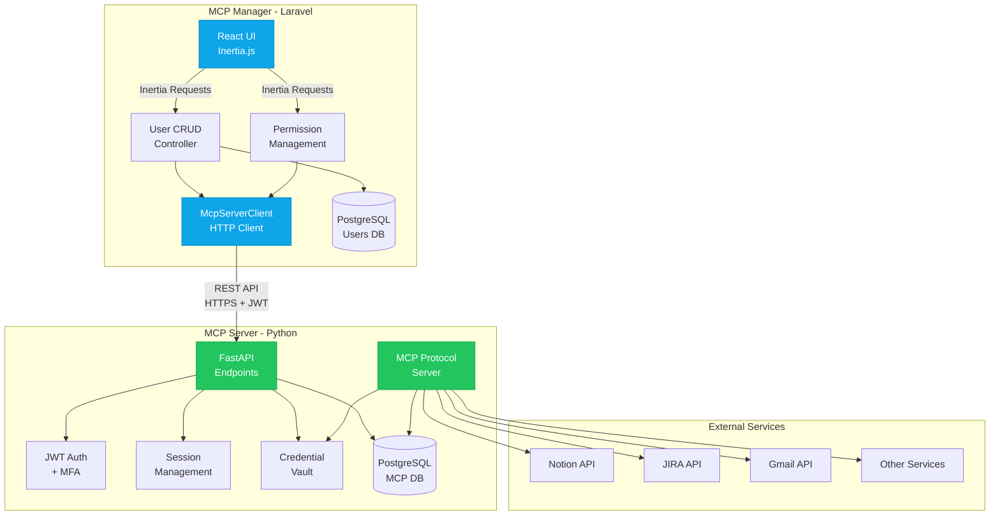
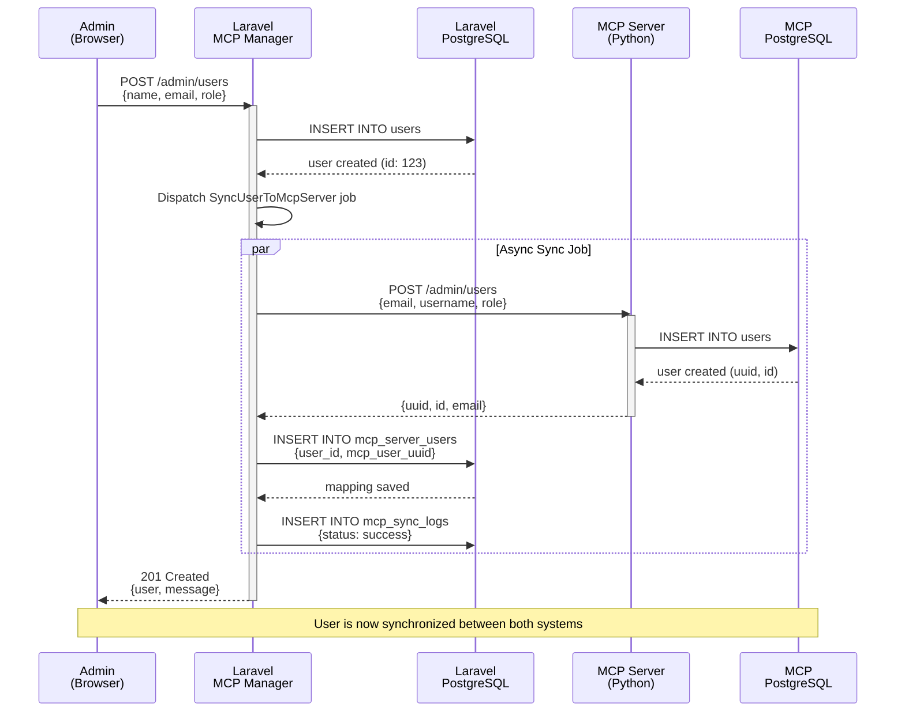
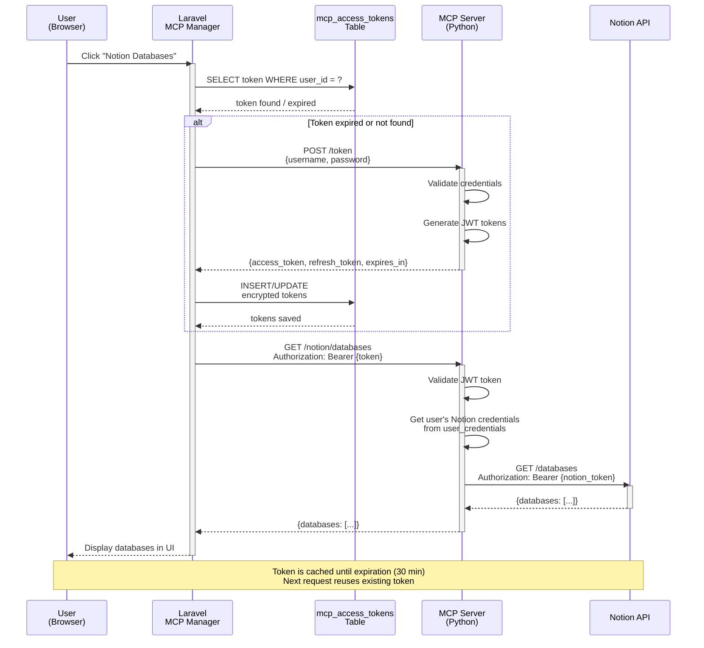
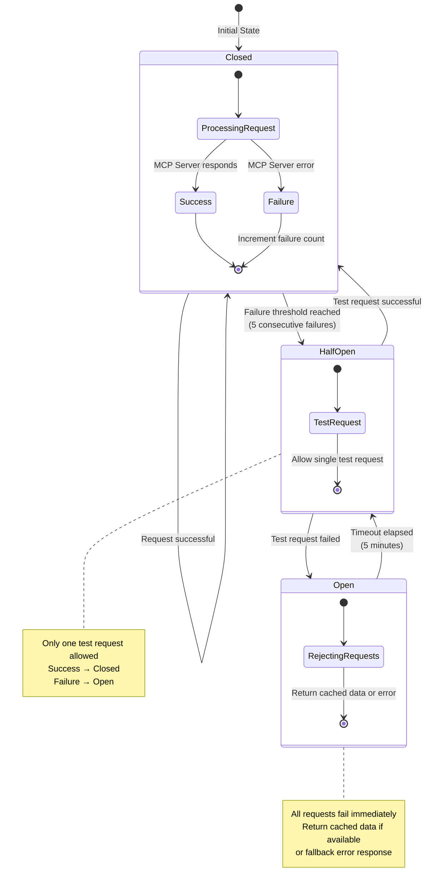

# MCP Manager ↔ MCP Server Integration Architecture

**Version:** 1.1
**Date:** 2025-11-01
**Authors:** Claude Code
**Status:** Recommendation Document (Enhanced with Diagrams & Config Examples)

---

## Table of Contents

1. [Executive Summary](#1-executive-summary)
2. [Current Architecture Analysis](#2-current-architecture-analysis)
3. [Integration Architecture](#3-integration-architecture)
4. [Database Schema Extensions](#4-database-schema-extensions)
5. [Authentication & Token Management](#5-authentication--token-management)
6. [User Synchronization Strategy](#6-user-synchronization-strategy)
7. [API Integration Layer](#7-api-integration-layer)
8. [Security Considerations](#8-security-considerations)
9. [Implementation Plan](#9-implementation-plan)
10. [Monitoring & Observability](#10-monitoring--observability)
11. [Migration Strategy](#11-migration-strategy)
12. [Testing Strategy](#12-testing-strategy)
13. [Alternatives Analysis](#13-alternatives-analysis)
14. [Appendices](#14-appendices)

---

## 1. Executive Summary

### 1.1 Objectif

Intégrer le **MCP Manager (Laravel)** avec le **MCP Server (Python/FastAPI)** pour créer un système unifié de gestion des utilisateurs tout en maintenant une séparation claire des responsabilités.

### 1.2 Approche Recommandée

**Hybrid Orchestrator Pattern** où :

- **MCP Manager** = Source de vérité pour les utilisateurs, UI/UX, gestion des permissions
- **MCP Server** = Service d'intégration MCP, vault de credentials, session management

### 1.3 Bénéfices Clés

✅ **Expérience utilisateur unifiée** - Un seul point d'entrée pour la gestion des utilisateurs
✅ **Sécurité renforcée** - Credentials chiffrés centralisés dans le MCP Server
✅ **Séparation des responsabilités** - Chaque système fait ce qu'il fait le mieux
✅ **Scalabilité** - Architecture découplée permettant l'évolution indépendante
✅ **Audit trail complet** - Logs corrélés entre les deux systèmes

---

## 2. Current Architecture Analysis

### 2.1 MCP Manager (Laravel 12)

**Fonctionnalités Implémentées :**

```
Backend:
├── User CRUD complet (UserManagementController)
├── Service Layer (UserManagementService)
├── RBAC avec 4 rôles : Admin, Manager, User, ReadOnly
├── 26+ permissions granulaires (UserPermission enum)
├── Activity logging (UserActivityLog)
├── Token management (UserToken)
├── Middleware : RequireRole, RequirePermission
└── ✨ Base64 Credential Generation

Frontend (React + Inertia.js):
├── Pages Admin/Users : Index, Create, Edit, Show
├── CredentialGenerator component avec Base64 encoding
├── Design System Monologue
└── Role-based navigation

Database:
├── users table (avec champs admin)
├── user_activity_logs table
├── user_tokens table
└── Migrations complètes
```

**Points Forts :**
- Interface utilisateur moderne et réactive
- Gestion granulaire des permissions
- Audit trail complet
- Tests unitaires et feature complets (16 tests passants)

**Limitations Actuelles :**
- Pas de gestion des credentials pour services externes (Notion, JIRA, etc.)
- Pas d'implémentation MCP protocol
- Pas de système de session avancé avec MFA

### 2.2 MCP Server (Python/FastAPI)

**Fonctionnalités Existantes :**

```
Authentication:
├── JWT token-based (access + refresh tokens)
├── Multi-Factor Authentication (TOTP)
├── Session management avancé (5 sessions max/user)
├── Account lockout (5 failed attempts = 30 min lock)
├── Backup codes pour MFA
└── OAuth2 compatible

User Management:
├── User model complet (id, uuid, email, username, role)
├── Role-based access control (Admin, Manager, User, ReadOnly)
├── Permissions granulaires (GLOBAL, PROJECT, SERVICE, RESOURCE scopes)
└── Admin API pour CRUD users

Security:
├── Bcrypt password hashing
├── Rate limiting (60 req/min, 1000 req/hour)
├── SQL injection protection
├── XSS prevention
├── Security headers (CSP, HSTS, etc.)
├── Comprehensive audit logging
└── Encrypted credential storage

Service Integrations:
├── Notion, JIRA, Confluence, Todoist
├── Gmail, Google Calendar
├── Sentry, OpenAI, Mistral, Anthropic
└── user_credentials table (encrypted service tokens)

Database:
├── PostgreSQL (production) + SQLite (dev)
├── Async SQLAlchemy
├── Alembic migrations
└── 15+ tables pour user management
```

**Points Forts :**
- Système d'authentification mature et sécurisé
- Intégration native avec multiples services
- Vault de credentials chiffré
- Infrastructure de sécurité robuste

**Limitations pour notre cas :**
- Pas d'interface utilisateur (API only)
- Gestion des users via API admin uniquement

---

## 3. Integration Architecture

### 3.1 Architecture Proposée : Hybrid Orchestrator

```
┌─────────────────────────────────────────────────────────────────┐
│                     MCP MANAGER (Laravel)                       │
│                                                                 │
│  ┌──────────────┐  ┌──────────────┐  ┌──────────────────────┐ │
│  │   React UI   │  │  User CRUD   │  │  Permission Mgmt     │ │
│  │  (Inertia)   │  │  Controller  │  │  (RBAC)              │ │
│  └──────────────┘  └──────────────┘  └──────────────────────┘ │
│                                                                 │
│  ┌──────────────────────────────────────────────────────────┐  │
│  │        McpServerClient (HTTP Client + Token Manager)      │  │
│  └──────────────────────────────────────────────────────────┘  │
│                              │                                  │
└──────────────────────────────┼──────────────────────────────────┘
                               │
                               │ REST API over HTTPS
                               │ (JWT Service Account)
                               │
┌──────────────────────────────▼──────────────────────────────────┐
│                     MCP SERVER (Python)                         │
│                                                                 │
│  ┌──────────────┐  ┌──────────────┐  ┌──────────────────────┐ │
│  │ JWT Auth     │  │ Session Mgmt │  │  Credential Vault    │ │
│  │ + MFA        │  │ + Audit Log  │  │  (Encrypted)         │ │
│  └──────────────┘  └──────────────┘  └──────────────────────┘ │
│                                                                 │
│  ┌──────────────────────────────────────────────────────────┐  │
│  │           MCP Protocol Server (STDIO/SSE)                 │  │
│  └──────────────────────────────────────────────────────────┘  │
│                              │                                  │
│  ┌──────────────────────────▼──────────────────────────────┐  │
│  │  Service Integrations: Notion, JIRA, Gmail, Calendar... │  │
│  └──────────────────────────────────────────────────────────┘  │
└─────────────────────────────────────────────────────────────────┘
```

#### Diagramme Mermaid : Architecture Globale



### 3.2 Flux de Données

#### Flux 1 : Création d'Utilisateur

```
Admin (Browser)
  │
  ├─► Laravel: POST /admin/users
  │     └─► UserManagementService::createUser()
  │           │
  │           ├─► Save to Laravel DB (users table)
  │           │
  │           └─► McpUserSyncService::syncToMcpServer()
  │                 │
  │                 └─► MCP Server: POST /admin/users
  │                       ├─► Create user in Python DB
  │                       ├─► Generate UUID
  │                       └─► Return { uuid, id, email }
  │
  │           ├─► Save mcp_user_uuid in mcp_server_users
  │           └─► Log activity
  │
  └─► Response: User created + synced
```

#### Flux 2 : Authentification et Accès Notion

```
User (Browser)
  │
  ├─► Laravel: Login (Breeze)
  │     └─► Session created
  │
  ├─► Click "Notion Databases"
  │
  ├─► Laravel Controller checks:
  │     ├─► mcp_access_tokens table
  │     └─► Token expired? → Refresh needed
  │
  ├─► McpTokenManager::getValidToken($user)
  │     │
  │     ├─► If no token or expired:
  │     │     └─► MCP Server: POST /token
  │     │           ├─► Body: { username: user@email, password: stored_pwd }
  │     │           └─► Response: { access_token, refresh_token, expires_in }
  │     │
  │     ├─► Store tokens encrypted in mcp_access_tokens
  │     └─► Return access_token
  │
  ├─► McpServiceProxy::notion()->listDatabases()
  │     │
  │     └─► MCP Server: GET /notion/databases
  │           ├─► Header: Authorization: Bearer {access_token}
  │           ├─► MCP Server validates token
  │           ├─► Fetches Notion credentials from user_credentials
  │           ├─► Calls Notion API
  │           └─► Returns databases
  │
  └─► Display Notion databases in UI
```

#### Diagramme Mermaid : Séquence de Création d'Utilisateur



#### Diagramme Mermaid : Séquence d'Authentification et Accès Service



### 3.3 Responsabilités par Système

| Responsabilité | MCP Manager (Laravel) | MCP Server (Python) |
|----------------|----------------------|---------------------|
| **User Interface** | ✅ Interface web complète | ❌ API only |
| **User CRUD** | ✅ Source de vérité | ✅ Réplica synchronisé |
| **Permissions UI** | ✅ Gestion visuelle | ❌ |
| **Authentication** | ✅ Laravel Breeze (session) | ✅ JWT tokens |
| **MFA** | ❌ Pas implémenté | ✅ TOTP + backup codes |
| **Session Management** | ✅ Basique (cookies) | ✅ Avancé (multi-device) |
| **Service Credentials** | ❌ | ✅ Encrypted vault |
| **MCP Protocol** | ❌ | ✅ STDIO + SSE |
| **Service Integrations** | ❌ (via proxy) | ✅ Direct (Notion, JIRA, etc.) |
| **Audit Logging** | ✅ User actions | ✅ Auth events + API calls |
| **Rate Limiting** | ✅ Laravel throttle | ✅ Comprehensive |

---

## 4. Database Schema Extensions

### 4.1 Nouvelles Tables Laravel

#### Table : `mcp_server_users`

**Objectif :** Mapping entre utilisateurs Laravel et MCP Server

```sql
CREATE TABLE mcp_server_users (
    id BIGINT UNSIGNED AUTO_INCREMENT PRIMARY KEY,
    user_id BIGINT UNSIGNED NOT NULL UNIQUE,
    mcp_user_uuid VARCHAR(36) NOT NULL UNIQUE COMMENT 'UUID from MCP Server',
    mcp_user_id INTEGER NOT NULL COMMENT 'Numeric ID from MCP Server',
    sync_status ENUM('pending', 'synced', 'error', 'out_of_sync') NOT NULL DEFAULT 'pending',
    last_sync_at TIMESTAMP NULL,
    sync_error TEXT NULL,
    sync_attempts INT DEFAULT 0,
    created_at TIMESTAMP DEFAULT CURRENT_TIMESTAMP,
    updated_at TIMESTAMP DEFAULT CURRENT_TIMESTAMP ON UPDATE CURRENT_TIMESTAMP,

    FOREIGN KEY (user_id) REFERENCES users(id) ON DELETE CASCADE,
    INDEX idx_sync_status (sync_status),
    INDEX idx_last_sync (last_sync_at)
) ENGINE=InnoDB DEFAULT CHARSET=utf8mb4 COLLATE=utf8mb4_unicode_ci;
```

#### Table : `mcp_access_tokens`

**Objectif :** Stockage des tokens JWT du MCP Server

```sql
CREATE TABLE mcp_access_tokens (
    id BIGINT UNSIGNED AUTO_INCREMENT PRIMARY KEY,
    user_id BIGINT UNSIGNED NOT NULL,
    access_token TEXT NOT NULL COMMENT 'Encrypted JWT access token',
    refresh_token TEXT NOT NULL COMMENT 'Encrypted JWT refresh token',
    token_type VARCHAR(20) DEFAULT 'bearer',
    expires_at TIMESTAMP NOT NULL,
    scope VARCHAR(255) DEFAULT 'read write',
    created_at TIMESTAMP DEFAULT CURRENT_TIMESTAMP,
    updated_at TIMESTAMP DEFAULT CURRENT_TIMESTAMP ON UPDATE CURRENT_TIMESTAMP,

    FOREIGN KEY (user_id) REFERENCES users(id) ON DELETE CASCADE,
    INDEX idx_user_expires (user_id, expires_at),
    INDEX idx_expires_at (expires_at)
) ENGINE=InnoDB DEFAULT CHARSET=utf8mb4 COLLATE=utf8mb4_unicode_ci;
```

#### Table : `mcp_sync_logs`

**Objectif :** Audit trail de la synchronisation

```sql
CREATE TABLE mcp_sync_logs (
    id BIGINT UNSIGNED AUTO_INCREMENT PRIMARY KEY,
    user_id BIGINT UNSIGNED,
    sync_type ENUM('create', 'update', 'delete', 'token_refresh') NOT NULL,
    direction ENUM('laravel_to_mcp', 'mcp_to_laravel') NOT NULL,
    status ENUM('success', 'failed', 'partial') NOT NULL,
    request_payload JSON NULL,
    response_payload JSON NULL,
    error_message TEXT NULL,
    duration_ms INT NULL COMMENT 'Request duration in milliseconds',
    created_at TIMESTAMP DEFAULT CURRENT_TIMESTAMP,

    FOREIGN KEY (user_id) REFERENCES users(id) ON DELETE SET NULL,
    INDEX idx_user_type (user_id, sync_type),
    INDEX idx_status_created (status, created_at)
) ENGINE=InnoDB DEFAULT CHARSET=utf8mb4 COLLATE=utf8mb4_unicode_ci;
```

### 4.2 Extension de la Table `users`

**Ajout de champs (optionnel) :**

```sql
ALTER TABLE users ADD COLUMN mcp_password_hash VARCHAR(255) NULL
    COMMENT 'Separate password for MCP Server (optional)';

ALTER TABLE users ADD COLUMN mcp_last_login_at TIMESTAMP NULL
    COMMENT 'Last login via MCP Server';
```

### 4.3 Mapping Rôles Laravel ↔ Python

| Laravel UserRole | Python UserRoleEnum | Description |
|------------------|---------------------|-------------|
| `admin` | `ADMIN` | Full system access |
| `manager` | `MANAGER` | User management + integrations |
| `user` | `USER` | Standard user access |
| `read_only` | `READONLY` | View-only access |

---

## 5. Authentication & Token Management

### 5.1 Token Lifecycle

```
┌─────────────────────────────────────────────────────────────┐
│                      Token Lifecycle                        │
└─────────────────────────────────────────────────────────────┘

1. User Login in Laravel
   └─► Laravel checks mcp_access_tokens

2. Token Missing or Expired
   └─► McpTokenManager::authenticate($user)
       │
       ├─► POST /token to MCP Server
       │   Body: {
       │     "username": "user@email.com",
       │     "password": "user_password"
       │   }
       │
       └─► Response: {
             "access_token": "eyJ...",
             "refresh_token": "eyJ...",
             "token_type": "bearer",
             "expires_in": 1800
           }

3. Store Tokens (Encrypted)
   └─► mcp_access_tokens table
       access_token: encrypt($accessToken)
       refresh_token: encrypt($refreshToken)
       expires_at: now() + 30 minutes

4. Token Refresh (Background Job)
   └─► Runs every 5 minutes
   └─► Finds tokens expiring < 5 minutes
   └─► POST /auth/refresh
       Body: { "refresh_token": "eyJ..." }
   └─► Updates access_token, extends expires_at
```

#### Diagramme Mermaid : Token Refresh Automatique

```mermaid
sequenceDiagram
    participant Scheduler as Laravel<br/>Scheduler
    participant Job as RefreshMcpTokens<br/>Job
    participant TokenDB as mcp_access_tokens<br/>Table
    participant MCP as MCP Server
    participant Log as mcp_sync_logs<br/>Table

    Note over Scheduler: Runs every 5 minutes

    Scheduler->>Job: Execute RefreshMcpTokensJob
    activate Job

    Job->>TokenDB: SELECT * WHERE<br/>expires_at < NOW() + 5 min
    TokenDB-->>Job: List of tokens to refresh

    loop For each expiring token
        Job->>MCP: POST /auth/refresh<br/>{refresh_token}
        activate MCP

        alt Refresh successful
            MCP-->>Job: {access_token, expires_in}
            deactivate MCP

            Job->>TokenDB: UPDATE<br/>access_token, expires_at
            TokenDB-->>Job: Token refreshed

            Job->>Log: INSERT<br/>{sync_type: token_refresh, status: success}
        else Refresh failed
            MCP-->>Job: 401 Unauthorized
            deactivate MCP

            Job->>TokenDB: DELETE expired token
            Job->>Log: INSERT<br/>{sync_type: token_refresh, status: failed}

            Note over Job: User will need to re-authenticate<br/>on next request
        end
    end

    Job-->>Scheduler: Job completed
    deactivate Job
```

#### Diagramme Mermaid : Gestion d'Erreurs et Circuit Breaker



### 5.2 Service Laravel : McpTokenManager

**Fichier :** `app/Services/McpServer/McpTokenManager.php`

**Méthodes :**

```php
class McpTokenManager
{
    /**
     * Obtient un token valide pour l'utilisateur (avec auto-refresh)
     */
    public function getValidToken(User $user): string;

    /**
     * Authentifie l'utilisateur et obtient de nouveaux tokens
     */
    public function authenticate(User $user, ?string $password = null): array;

    /**
     * Rafraîchit un access token expiré
     */
    public function refreshToken(User $user): string;

    /**
     * Révoque tous les tokens d'un utilisateur
     */
    public function revokeTokens(User $user): void;

    /**
     * Vérifie si un token est valide (non expiré)
     */
    public function isTokenValid(User $user): bool;
}
```

**Implémentation clé :**

```php
public function getValidToken(User $user): string
{
    $tokenRecord = McpAccessToken::where('user_id', $user->id)
        ->where('expires_at', '>', now())
        ->first();

    if ($tokenRecord) {
        return decrypt($tokenRecord->access_token);
    }

    // Token absent ou expiré → rafraîchir
    $tokenRecord = McpAccessToken::where('user_id', $user->id)->first();

    if ($tokenRecord && $tokenRecord->refresh_token) {
        try {
            return $this->refreshToken($user);
        } catch (\Exception $e) {
            Log::warning('Token refresh failed, re-authenticating', [
                'user_id' => $user->id,
                'error' => $e->getMessage(),
            ]);
        }
    }

    // Réauthentification complète
    $mcpPassword = $user->mcp_password_hash ?? $this->generateMcpPassword($user);
    $tokens = $this->authenticate($user, $mcpPassword);

    return $tokens['access_token'];
}
```

### 5.3 Gestion du MFA

**Scénario :** Utilisateur a activé MFA dans le MCP Server

```php
// Réponse de POST /token quand MFA est requis
{
    "access_token": "temp_token_...",
    "mfa_required": true,
    "token_type": "mfa_pending",
    "expires_in": 300  // 5 minutes
}

// Flow Laravel
if ($response['mfa_required'] ?? false) {
    // Rediriger vers page MFA
    return redirect()->route('mcp.mfa.verify', [
        'temp_token' => $response['access_token'],
        'user_id' => $user->id,
    ]);
}

// Page MFA : utilisateur entre code TOTP
// Submit → POST /auth/verify-mfa
{
    "mfa_token": "123456"  // code à 6 chiffres
}

// Réponse : tokens finaux
{
    "access_token": "eyJ...",
    "refresh_token": "eyJ...",
    "expires_in": 1800
}
```

---

## 6. User Synchronization Strategy

### 6.1 Événements Déclencheurs

| Événement Laravel | Action MCP Server | Synchrone/Async |
|-------------------|-------------------|-----------------|
| User créé | POST /admin/users | Async (Job) |
| User modifié | PUT /admin/users/{id} | Async (Job) |
| User supprimé | DELETE /admin/users/{id} | Async (Job) |
| Password changé | POST /admin/users/{id}/reset-password | Async (Job) |
| Role changé | PUT /admin/users/{id} (full update) | Async (Job) |

### 6.2 Service : McpUserSyncService

**Fichier :** `app/Services/McpServer/McpUserSyncService.php`

```php
class McpUserSyncService
{
    public function __construct(
        private McpServerClient $client,
        private McpTokenManager $tokenManager
    ) {}

    /**
     * Synchronise un utilisateur Laravel vers MCP Server
     */
    public function syncUser(User $user, string $action = 'create'): bool
    {
        try {
            $payload = $this->buildUserPayload($user);

            switch ($action) {
                case 'create':
                    $response = $this->client->post('/admin/users', $payload);
                    $this->saveSyncMapping($user, $response);
                    break;

                case 'update':
                    $mcpUserId = $this->getMcpUserId($user);
                    $response = $this->client->put("/admin/users/{$mcpUserId}", $payload);
                    break;

                case 'delete':
                    $mcpUserId = $this->getMcpUserId($user);
                    $response = $this->client->delete("/admin/users/{$mcpUserId}");
                    break;
            }

            $this->logSync($user, $action, 'success', $payload, $response);
            $this->updateSyncStatus($user, 'synced');

            return true;

        } catch (\Exception $e) {
            $this->logSync($user, $action, 'failed', $payload, null, $e->getMessage());
            $this->updateSyncStatus($user, 'error', $e->getMessage());

            return false;
        }
    }

    private function buildUserPayload(User $user): array
    {
        return [
            'email' => $user->email,
            'username' => $user->email, // ou générer username unique
            'password' => $user->mcp_password_hash ?? $this->generateSecurePassword(),
            'first_name' => explode(' ', $user->name)[0] ?? null,
            'last_name' => explode(' ', $user->name)[1] ?? null,
            'role' => $this->mapRole($user->role),
            'is_active' => $user->is_active,
            'metadata' => [
                'laravel_user_id' => $user->id,
                'created_in' => 'laravel_manager',
                'sync_version' => '1.0',
            ],
        ];
    }

    private function mapRole(UserRole $laravelRole): string
    {
        return match($laravelRole) {
            UserRole::ADMIN => 'admin',
            UserRole::MANAGER => 'manager',
            UserRole::USER => 'user',
            UserRole::READ_ONLY => 'readonly',
        };
    }
}
```

### 6.3 Job Asynchrone : SyncUserToMcpServer

**Fichier :** `app/Jobs/SyncUserToMcpServer.php`

```php
class SyncUserToMcpServer implements ShouldQueue
{
    use Dispatchable, InteractsWithQueue, Queueable, SerializesModels;

    public function __construct(
        public User $user,
        public string $action = 'create'
    ) {}

    public function handle(McpUserSyncService $syncService): void
    {
        $syncService->syncUser($this->user, $this->action);
    }

    public function failed(\Throwable $exception): void
    {
        Log::error('MCP user sync failed', [
            'user_id' => $this->user->id,
            'action' => $this->action,
            'error' => $exception->getMessage(),
        ]);

        // Optionnel : notifier l'admin
        // Notification::route('mail', config('mail.admin'))
        //     ->notify(new McpSyncFailedNotification($this->user, $exception));
    }
}
```

### 6.4 Event Listeners

**Fichier :** `app/Providers/EventServiceProvider.php`

```php
protected $listen = [
    'App\Events\UserCreatedInManager' => [
        'App\Listeners\SyncUserToMcp',
    ],
    'App\Events\UserUpdatedInManager' => [
        'App\Listeners\SyncUserToMcp',
    ],
    'App\Events\UserDeletedInManager' => [
        'App\Listeners\SyncUserToMcp',
    ],
];
```

**Listener :** `app/Listeners/SyncUserToMcp.php`

```php
class SyncUserToMcp
{
    public function handle($event): void
    {
        $action = match(get_class($event)) {
            UserCreatedInManager::class => 'create',
            UserUpdatedInManager::class => 'update',
            UserDeletedInManager::class => 'delete',
        };

        SyncUserToMcpServer::dispatch($event->user, $action);
    }
}
```

---

## 7. API Integration Layer

### 7.1 HTTP Client : McpServerClient

**Fichier :** `app/Services/McpServer/McpServerClient.php`

```php
class McpServerClient
{
    private string $baseUrl;
    private string $serviceAccountEmail;
    private string $serviceAccountPassword;
    private ?string $serviceToken = null;

    public function __construct()
    {
        $this->baseUrl = config('mcp-server.base_url');
        $this->serviceAccountEmail = config('mcp-server.service_account.email');
        $this->serviceAccountPassword = config('mcp-server.service_account.password');
    }

    /**
     * Effectue une requête GET
     */
    public function get(string $endpoint, array $params = []): array
    {
        return $this->request('GET', $endpoint, ['query' => $params]);
    }

    /**
     * Effectue une requête POST
     */
    public function post(string $endpoint, array $data = []): array
    {
        return $this->request('POST', $endpoint, ['json' => $data]);
    }

    /**
     * Effectue une requête PUT
     */
    public function put(string $endpoint, array $data = []): array
    {
        return $this->request('PUT', $endpoint, ['json' => $data]);
    }

    /**
     * Effectue une requête DELETE
     */
    public function delete(string $endpoint): array
    {
        return $this->request('DELETE', $endpoint);
    }

    /**
     * Requête HTTP générique avec authentification
     */
    private function request(string $method, string $endpoint, array $options = []): array
    {
        $token = $this->getServiceToken();

        $response = Http::withToken($token)
            ->timeout(30)
            ->retry(3, 100)
            ->$method($this->baseUrl . $endpoint, $options);

        if ($response->failed()) {
            throw new McpServerException(
                "MCP Server request failed: {$response->status()} - {$response->body()}",
                $response->status()
            );
        }

        return $response->json();
    }

    /**
     * Obtient ou rafraîchit le token du service account
     */
    private function getServiceToken(): string
    {
        if ($this->serviceToken && $this->isServiceTokenValid()) {
            return $this->serviceToken;
        }

        $response = Http::post($this->baseUrl . '/token', [
            'username' => $this->serviceAccountEmail,
            'password' => $this->serviceAccountPassword,
        ]);

        if ($response->failed()) {
            throw new McpServerException('Service account authentication failed');
        }

        $data = $response->json();
        $this->serviceToken = $data['access_token'];

        Cache::put('mcp_service_token', $this->serviceToken, now()->addMinutes(25));
        Cache::put('mcp_service_token_expires', now()->addMinutes(30), now()->addMinutes(30));

        return $this->serviceToken;
    }

    private function isServiceTokenValid(): bool
    {
        return Cache::has('mcp_service_token_expires')
            && Cache::get('mcp_service_token_expires') > now()->addMinutes(5);
    }
}
```

### 7.2 Service Proxy : McpServiceProxy

**Fichier :** `app/Services/McpServer/McpServiceProxy.php`

**Objectif :** Proxy transparent vers les services MCP (Notion, JIRA, etc.)

```php
class McpServiceProxy
{
    public function __construct(
        private McpServerClient $client,
        private McpTokenManager $tokenManager
    ) {}

    /**
     * Proxy Notion
     */
    public function notion(User $user): NotionProxy
    {
        return new NotionProxy($this->client, $this->tokenManager, $user);
    }

    /**
     * Proxy JIRA
     */
    public function jira(User $user): JiraProxy
    {
        return new JiraProxy($this->client, $this->tokenManager, $user);
    }

    // ... autres services
}

class NotionProxy
{
    public function __construct(
        private McpServerClient $client,
        private McpTokenManager $tokenManager,
        private User $user
    ) {}

    public function listDatabases(): array
    {
        $token = $this->tokenManager->getValidToken($this->user);

        return $this->client->get('/notion/databases', [], $token);
    }

    public function getDatabase(string $databaseId): array
    {
        $token = $this->tokenManager->getValidToken($this->user);

        return $this->client->get("/notion/databases/{$databaseId}", [], $token);
    }

    public function queryDatabase(string $databaseId, array $filter = []): array
    {
        $token = $this->tokenManager->getValidToken($this->user);

        return $this->client->post("/notion/databases/{$databaseId}/query", ['filter' => $filter], $token);
    }
}
```

**Usage dans un Controller :**

```php
class NotionController extends Controller
{
    public function __construct(
        private McpServiceProxy $mcpProxy
    ) {}

    public function index(Request $request)
    {
        $user = $request->user();

        try {
            $databases = $this->mcpProxy->notion($user)->listDatabases();

            return Inertia::render('Notion/Index', [
                'databases' => $databases,
            ]);

        } catch (McpServerException $e) {
            return back()->with('error', 'Failed to fetch Notion databases: ' . $e->getMessage());
        }
    }
}
```

---

## 8. Security Considerations

### 8.1 Checklist Sécurité

| Aspect | Implémentation | Status |
|--------|----------------|--------|
| **HTTPS Obligatoire** | nginx/Apache avec SSL/TLS 1.3 | ✅ Production only |
| **Token Encryption** | Laravel Encrypter (AES-256-CBC) | ✅ Requis |
| **Service Account** | Compte dédié avec rôle ADMIN | ✅ Créer manuellement |
| **Rate Limiting** | Respecter 60 req/min du MCP Server | ✅ Throttle Laravel |
| **Webhook Signatures** | HMAC-SHA256 des payloads | ⚠️ Si webhooks utilisés |
| **Audit Correlation** | user_id + mcp_user_uuid | ✅ Via mcp_sync_logs |
| **Password Separation** | Passwords Laravel ≠ MCP Server | ✅ Optionnel mais recommandé |
| **Token Rotation** | Auto-refresh avant expiration | ✅ Background job |
| **MFA Handling** | Fallback graceful si MFA activé | ⚠️ À implémenter |
| **IP Whitelisting** | Limiter accès API admin | ⚠️ Configuration MCP Server |

### 8.2 Stockage Sécurisé des Credentials

**Configuration Laravel :**

```php
// config/app.php
'cipher' => 'AES-256-CBC',

// .env
APP_KEY=base64:xxxxxxxxxxxxxxxxxxxxxxxxxxx
```

**Encryption des tokens :**

```php
// Avant stockage
$encryptedToken = encrypt($accessToken);

// Avant utilisation
$accessToken = decrypt($encryptedToken);
```

**Séparation des passwords (recommandé) :**

```php
// users table
password          → Bcrypt hash pour Laravel Breeze
mcp_password_hash → Password différent pour MCP Server (optionnel)

// Avantage :
// - Compromission d'un système n'affecte pas l'autre
// - Permet rotation indépendante des passwords
```

### 8.3 Gestion des Erreurs d'Authentification

**Cas d'erreur :**

```php
try {
    $token = $this->tokenManager->getValidToken($user);
} catch (McpAuthenticationException $e) {
    // Scénarios possibles :

    // 1. Compte verrouillé (5 failed attempts)
    if ($e->getCode() === 403 && str_contains($e->getMessage(), 'locked')) {
        return back()->with('error', 'Your MCP account is temporarily locked. Please try again in 30 minutes.');
    }

    // 2. MFA requis mais pas configuré dans Laravel
    if ($e->isMfaRequired()) {
        return redirect()->route('mcp.mfa.setup');
    }

    // 3. Service account invalide
    if ($e->getCode() === 401) {
        Log::critical('MCP service account authentication failed');
        return back()->with('error', 'Integration error. Please contact support.');
    }

    // 4. MCP Server indisponible
    if ($e->getCode() === 0) {
        return back()->with('error', 'MCP Server is currently unavailable. Please try again later.');
    }
}
```

### 8.4 Rate Limiting Strategy

**MCP Server Limits :**
- 60 requêtes/minute par IP
- 1000 requêtes/heure par IP

**Stratégie Laravel :**

```php
// app/Services/McpServer/McpServerClient.php
private function request(string $method, string $endpoint, array $options = []): array
{
    // Rate limit check local
    $key = 'mcp_rate_limit:' . request()->ip();
    $requests = Cache::get($key, 0);

    if ($requests >= 50) { // Seuil de sécurité à 50/min
        throw new RateLimitException('MCP Server rate limit approaching. Slow down requests.');
    }

    Cache::put($key, $requests + 1, now()->addMinute());

    // Requête HTTP
    $response = Http::withToken($token)
        ->timeout(30)
        ->retry(3, 100, function ($exception, $request) {
            // Retry seulement sur erreurs réseau, pas sur 429
            return $exception->getCode() !== 429;
        })
        ->$method($this->baseUrl . $endpoint, $options);

    // Si 429 reçu, backoff exponentiel
    if ($response->status() === 429) {
        $retryAfter = $response->header('Retry-After', 60);
        sleep($retryAfter);
        return $this->request($method, $endpoint, $options); // Retry une fois
    }

    return $response->json();
}
```

---

## 9. Implementation Plan

### 9.1 Timeline Détaillé

#### **Phase 1 : Infrastructure (Jours 1-2)**

**Jour 1 : Database & Configuration**

- [ ] Créer migration `create_mcp_server_users_table`
- [ ] Créer migration `create_mcp_access_tokens_table`
- [ ] Créer migration `create_mcp_sync_logs_table`
- [ ] Ajouter colonne `mcp_password_hash` à `users` (optionnel)
- [ ] Exécuter migrations
- [ ] Créer config file `config/mcp-server.php`
- [ ] Ajouter variables `.env`
  ```
  MCP_SERVER_URL=http://localhost:8000
  MCP_SERVICE_ACCOUNT_EMAIL=laravel-manager@system.local
  MCP_SERVICE_ACCOUNT_PASSWORD=<generate-secure>
  MCP_TOKEN_REFRESH_THRESHOLD=300
  ```
- [ ] Créer service account dans MCP Server (via Python)
  ```bash
  python create_admin_user.py \
    --email laravel-manager@system.local \
    --password <secure-password> \
    --role admin \
    --username laravel-manager
  ```

**Jour 2 : HTTP Client & Models**

- [ ] Créer `app/Services/McpServer/McpServerClient.php`
- [ ] Créer exception `McpServerException`
- [ ] Créer model `McpServerUser`
- [ ] Créer model `McpAccessToken`
- [ ] Créer model `McpSyncLog`
- [ ] Tests unitaires `McpServerClientTest`
  - Test authentication
  - Test request retry
  - Test rate limiting
  - Test error handling

#### **Phase 2 : User Synchronization (Jours 3-4)**

**Jour 3 : Sync Service**

- [ ] Créer `app/Services/McpServer/McpUserSyncService.php`
- [ ] Implémenter `syncUser()` avec actions create/update/delete
- [ ] Implémenter `buildUserPayload()`
- [ ] Implémenter mapping des rôles
- [ ] Créer job `SyncUserToMcpServer`
- [ ] Tests unitaires `McpUserSyncServiceTest`

**Jour 4 : Events & Listeners**

- [ ] Créer events `UserCreatedInManager`, `UserUpdatedInManager`, `UserDeletedInManager`
- [ ] Créer listener `SyncUserToMcp`
- [ ] Enregistrer events dans `EventServiceProvider`
- [ ] Modifier `UserManagementService` pour dispatch events
- [ ] Tests feature `UserSyncIntegrationTest`

**Script migration utilisateurs existants :**

```php
// database/seeders/SyncExistingUsersToMcpSeeder.php
class SyncExistingUsersToMcpSeeder extends Seeder
{
    public function run(McpUserSyncService $syncService): void
    {
        $users = User::whereDoesntHave('mcpServerUser')->get();

        $this->command->info("Syncing {$users->count()} users to MCP Server...");

        foreach ($users as $user) {
            try {
                $syncService->syncUser($user, 'create');
                $this->command->info("✓ Synced user: {$user->email}");
            } catch (\Exception $e) {
                $this->command->error("✗ Failed to sync {$user->email}: {$e->getMessage()}");
            }
        }

        $this->command->info('Sync complete!');
    }
}
```

#### **Phase 3 : Token Management (Jours 5-6)**

**Jour 5 : Token Manager**

- [ ] Créer `app/Services/McpServer/McpTokenManager.php`
- [ ] Implémenter `getValidToken()`
- [ ] Implémenter `authenticate()`
- [ ] Implémenter `refreshToken()`
- [ ] Implémenter `revokeTokens()`
- [ ] Tests unitaires `McpTokenManagerTest`

**Jour 6 : Auto-refresh Job**

- [ ] Créer job `RefreshMcpTokens`
- [ ] Scheduler Laravel (exécution toutes les 5 minutes)
  ```php
  // app/Console/Kernel.php
  protected function schedule(Schedule $schedule): void
  {
      $schedule->job(new RefreshMcpTokens)->everyFiveMinutes();
  }
  ```
- [ ] Tests `RefreshMcpTokensTest`

#### **Phase 4 : Service Proxy (Jours 7-8)**

**Jour 7 : Proxy Services**

- [ ] Créer `app/Services/McpServer/McpServiceProxy.php`
- [ ] Créer `app/Services/McpServer/Proxies/NotionProxy.php`
- [ ] Créer `app/Services/McpServer/Proxies/JiraProxy.php`
- [ ] Implémenter méthodes principales (listDatabases, etc.)
- [ ] Tests `NotionProxyTest`, `JiraProxyTest`

**Jour 8 : UI Integration**

- [ ] Modifier `NotionController` pour utiliser `McpServiceProxy`
- [ ] Modifier `JiraController` pour utiliser `McpServiceProxy`
- [ ] Ajouter gestion erreurs dans UI (toasts, messages)
- [ ] Tests E2E avec Playwright (user flow complet)

#### **Phase 5 : Monitoring & Documentation (Jour 9)**

- [ ] Setup monitoring (logs, metrics)
- [ ] Dashboard admin pour sync status
- [ ] Documentation utilisateur
- [ ] Documentation développeur
- [ ] Runbook troubleshooting

#### **Phase 6 : Testing & Rollout (Jour 10)**

- [ ] Test suite complète (unit + feature + integration)
- [ ] Performance testing
- [ ] Security audit
- [ ] Staging deployment
- [ ] Production rollout progressif (10% → 50% → 100%)

### 9.2 Commandes Artisan Utiles

**Créer service account :**
```bash
php artisan mcp:create-service-account \
  --email=laravel-manager@system.local \
  --force
```

**Sync utilisateurs existants :**
```bash
php artisan mcp:sync-users --all
```

**Vérifier statut sync :**
```bash
php artisan mcp:sync-status
```

**Rafraîchir tokens manuellement :**
```bash
php artisan mcp:refresh-tokens
```

**Diagnostics :**
```bash
php artisan mcp:diagnose
```

---

## 10. Monitoring & Observability

### 10.1 Métriques Clés

| Métrique | Description | Seuil d'alerte |
|----------|-------------|----------------|
| **Sync Success Rate** | % de syncs réussies | < 95% |
| **Token Refresh Success** | % de refresh réussis | < 98% |
| **MCP API Latency** | Temps de réponse moyen | > 2 secondes |
| **Failed Requests** | Erreurs 4xx/5xx | > 10/heure |
| **Rate Limit Hits** | 429 responses | > 0 |
| **Queue Depth** | Jobs en attente | > 1000 |

### 10.2 Dashboard Admin

**Route :** `/admin/mcp/dashboard`

**Widgets :**

1. **Sync Status Overview**
   - Total users synced
   - Pending syncs
   - Failed syncs (last 24h)
   - Sync success rate (last 7 days)

2. **Token Health**
   - Active tokens
   - Tokens expiring soon (< 10 min)
   - Failed refreshes (last 24h)

3. **API Performance**
   - Average latency (last hour)
   - Request volume (last 24h)
   - Error rate

4. **Recent Sync Logs**
   - Table des 50 derniers syncs
   - Filtres : status, type, user

**Code Controller :**

```php
class McpDashboardController extends Controller
{
    public function index()
    {
        $stats = [
            'total_synced' => McpServerUser::where('sync_status', 'synced')->count(),
            'pending_syncs' => McpServerUser::where('sync_status', 'pending')->count(),
            'failed_syncs' => McpSyncLog::where('status', 'failed')
                ->where('created_at', '>', now()->subDay())
                ->count(),
            'sync_success_rate' => $this->calculateSuccessRate(),
            'active_tokens' => McpAccessToken::where('expires_at', '>', now())->count(),
            'expiring_soon' => McpAccessToken::whereBetween('expires_at', [
                now(),
                now()->addMinutes(10)
            ])->count(),
        ];

        $recentLogs = McpSyncLog::with('user')
            ->latest()
            ->limit(50)
            ->get();

        return Inertia::render('Admin/Mcp/Dashboard', [
            'stats' => $stats,
            'recentLogs' => $recentLogs,
        ]);
    }
}
```

### 10.3 Logging Strategy

**Log Channels :**

```php
// config/logging.php
'channels' => [
    'mcp-integration' => [
        'driver' => 'daily',
        'path' => storage_path('logs/mcp-integration.log'),
        'level' => env('LOG_LEVEL', 'info'),
        'days' => 14,
    ],

    'mcp-errors' => [
        'driver' => 'daily',
        'path' => storage_path('logs/mcp-errors.log'),
        'level' => 'error',
        'days' => 30,
    ],
],
```

**Structured Logging :**

```php
Log::channel('mcp-integration')->info('User synced to MCP Server', [
    'user_id' => $user->id,
    'mcp_user_uuid' => $mcpUser->uuid,
    'action' => 'create',
    'duration_ms' => $duration,
    'timestamp' => now()->toIso8601String(),
]);
```

### 10.4 Alerting

**Notifications critiques :**

```php
// app/Notifications/McpSyncFailureAlert.php
class McpSyncFailureAlert extends Notification
{
    public function via($notifiable): array
    {
        return ['mail', 'slack'];
    }

    public function toMail($notifiable): MailMessage
    {
        return (new MailMessage)
            ->error()
            ->subject('⚠️ MCP Sync Failure Alert')
            ->line("Failed syncs in the last hour: {$this->failureCount}")
            ->action('View Dashboard', url('/admin/mcp/dashboard'))
            ->line('Please investigate immediately.');
    }
}
```

**Trigger :**

```php
// app/Console/Commands/MonitorMcpHealth.php
if ($failedSyncsLastHour > 10) {
    Notification::route('mail', config('mail.admin_email'))
        ->notify(new McpSyncFailureAlert($failedSyncsLastHour));
}
```

---

## 11. Migration Strategy

### 11.1 Stratégie de Déploiement

**Approche : Progressive Rollout**

```
┌─────────────────────────────────────────────────────────────┐
│                    Progressive Rollout                      │
└─────────────────────────────────────────────────────────────┘

Week 1: Development & Testing
├─ Implémentation complète
├─ Tests unitaires + feature
└─ Staging deployment

Week 2: Canary Release (10%)
├─ 10% des utilisateurs (commencer par rôle test)
├─ Monitoring intensif
└─ Rollback plan prêt

Week 3: Expanded Release (50%)
├─ 50% des utilisateurs
├─ Monitoring continue
└─ Performance tuning

Week 4: Full Release (100%)
├─ 100% des utilisateurs
├─ Documentation finalisée
└─ Post-mortem review
```

### 11.2 Feature Flags

**Contrôle granulaire du rollout :**

```php
// config/mcp-server.php
return [
    'features' => [
        'sync_enabled' => env('MCP_SYNC_ENABLED', false),
        'token_refresh_enabled' => env('MCP_TOKEN_REFRESH_ENABLED', false),
        'proxy_services_enabled' => env('MCP_PROXY_ENABLED', false),
    ],

    'rollout' => [
        'percentage' => env('MCP_ROLLOUT_PERCENTAGE', 0), // 0-100
        'allowed_roles' => ['admin', 'manager'], // Rollout par rôle
        'allowed_user_ids' => [], // Whitelist utilisateurs
    ],
];
```

**Usage :**

```php
// Dans UserManagementService::createUser()
if (config('mcp-server.features.sync_enabled') && $this->isUserInRollout($user)) {
    event(new UserCreatedInManager($user));
}

private function isUserInRollout(User $user): bool
{
    $rollout = config('mcp-server.rollout');

    // Whitelist
    if (in_array($user->id, $rollout['allowed_user_ids'])) {
        return true;
    }

    // Rollout par rôle
    if (in_array($user->role->value, $rollout['allowed_roles'])) {
        return true;
    }

    // Rollout par pourcentage (hash stable)
    $hash = crc32($user->email);
    $percentage = ($hash % 100);

    return $percentage < $rollout['percentage'];
}
```

### 11.3 Rollback Plan

**Scénarios de rollback :**

1. **Sync errors > 20% dans 1 heure**
   ```bash
   # Désactiver sync
   php artisan config:set MCP_SYNC_ENABLED=false
   php artisan cache:clear
   ```

2. **MCP Server indisponible**
   ```bash
   # Circuit breaker automatique
   # Proxy services passent en mode fallback
   php artisan mcp:enable-fallback-mode
   ```

3. **Performance dégradée**
   ```bash
   # Réduire rollout percentage
   php artisan mcp:adjust-rollout --percentage=10
   ```

**Circuit Breaker :**

```php
class McpCircuitBreaker
{
    public function call(callable $callback)
    {
        $failures = Cache::get('mcp_circuit_breaker_failures', 0);

        // Circuit ouvert → fail fast
        if ($failures >= 5) {
            if (!$this->shouldRetry()) {
                throw new CircuitBreakerOpenException('MCP Server circuit breaker is open');
            }
        }

        try {
            $result = $callback();
            Cache::put('mcp_circuit_breaker_failures', 0, now()->addMinutes(5));
            return $result;
        } catch (\Exception $e) {
            Cache::increment('mcp_circuit_breaker_failures');
            throw $e;
        }
    }

    private function shouldRetry(): bool
    {
        // Retry après 5 minutes
        return Cache::get('mcp_circuit_breaker_last_attempt') < now()->subMinutes(5);
    }
}
```

---

## 12. Testing Strategy

### 12.1 Pyramide de Tests

```
         ╱────────╲          10 tests E2E
        ╱  E2E     ╲         (Playwright)
       ╱────────────╲
      ╱  Integration ╲       30 tests Integration
     ╱────────────────╲      (Laravel Feature)
    ╱   Unit Tests     ╲     100 tests Unit
   ╱────────────────────╲    (PHPUnit)
  ╱──────────────────────╲
 ╱  Static Analysis      ╲  PHPStan, Pint
╱──────────────────────────╲
```

### 12.2 Tests Unitaires

**McpServerClientTest :**

```php
class McpServerClientTest extends TestCase
{
    public function test_authenticate_returns_valid_token(): void
    {
        Http::fake([
            '*/token' => Http::response([
                'access_token' => 'fake_token',
                'refresh_token' => 'fake_refresh',
                'expires_in' => 1800,
            ], 200),
        ]);

        $client = new McpServerClient();
        $token = $client->authenticate('user@test.com', 'password');

        $this->assertEquals('fake_token', $token);
    }

    public function test_rate_limiting_throws_exception(): void
    {
        Cache::put('mcp_rate_limit:127.0.0.1', 51, now()->addMinute());

        $this->expectException(RateLimitException::class);

        $client = new McpServerClient();
        $client->get('/test');
    }
}
```

**McpTokenManagerTest :**

```php
class McpTokenManagerTest extends TestCase
{
    use RefreshDatabase;

    public function test_get_valid_token_returns_existing_token(): void
    {
        $user = User::factory()->create();
        McpAccessToken::create([
            'user_id' => $user->id,
            'access_token' => encrypt('valid_token'),
            'refresh_token' => encrypt('refresh_token'),
            'expires_at' => now()->addMinutes(10),
        ]);

        $manager = new McpTokenManager(new McpServerClient());
        $token = $manager->getValidToken($user);

        $this->assertEquals('valid_token', $token);
    }

    public function test_get_valid_token_refreshes_expired_token(): void
    {
        // ... test refresh logic
    }
}
```

### 12.3 Tests d'Intégration

**UserSyncIntegrationTest :**

```php
class UserSyncIntegrationTest extends TestCase
{
    use RefreshDatabase;

    public function test_user_creation_triggers_sync_to_mcp(): void
    {
        Http::fake([
            '*/admin/users' => Http::response([
                'uuid' => 'test-uuid-1234',
                'id' => 42,
                'email' => 'newuser@test.com',
            ], 201),
        ]);

        $admin = User::factory()->admin()->create();

        $this->actingAs($admin)->post('/admin/users', [
            'name' => 'New User',
            'email' => 'newuser@test.com',
            'role' => 'user',
            'is_active' => true,
        ]);

        // Vérifier que le job a été dispatché
        Bus::assertDispatched(SyncUserToMcpServer::class);

        // Exécuter le job
        $user = User::where('email', 'newuser@test.com')->first();
        (new SyncUserToMcpServer($user, 'create'))->handle(new McpUserSyncService());

        // Vérifier mapping créé
        $this->assertDatabaseHas('mcp_server_users', [
            'user_id' => $user->id,
            'mcp_user_uuid' => 'test-uuid-1234',
            'sync_status' => 'synced',
        ]);
    }
}
```

### 12.4 Tests E2E (Playwright)

**user-management-mcp-integration.spec.ts :**

```typescript
test('admin can create user and access Notion via MCP', async ({ page }) => {
    // Login as admin
    await page.goto('/login');
    await page.fill('input[name="email"]', 'admin@example.com');
    await page.fill('input[name="password"]', 'password');
    await page.click('button[type="submit"]');

    // Create new user
    await page.goto('/admin/users/create');
    await page.fill('input[name="name"]', 'Test User');
    await page.fill('input[name="email"]', 'testuser@example.com');
    await page.selectOption('select[name="role"]', 'user');
    await page.click('button:has-text("Create User")');

    // Wait for sync
    await page.waitForSelector('text=User created successfully');

    // Verify MCP sync status
    await expect(page.locator('[data-testid="mcp-sync-status"]')).toHaveText('Synced');

    // Generate credentials
    await page.click('button:has-text("Generate Credentials")');
    await expect(page.locator('[data-testid="basic-auth"]')).toBeVisible();

    // Login as new user
    await page.goto('/logout');
    await page.goto('/login');
    await page.fill('input[name="email"]', 'testuser@example.com');
    await page.fill('input[name="password"]', generatedPassword);
    await page.click('button[type="submit"]');

    // Access Notion (via MCP Server proxy)
    await page.goto('/notion');
    await expect(page.locator('text=Notion Databases')).toBeVisible();
    await expect(page.locator('[data-testid="database-list"]')).not.toBeEmpty();
});
```

---

## 13. Alternatives Analysis

### Alternative 1 : Full Database Replication

**Description :** Dupliquer toutes les données users dans les deux bases de données avec sync bidirectionnelle

**Architecture :**
```
Laravel DB (PostgreSQL)      Python DB (PostgreSQL)
    users                ←→      users
    user_activity_logs   ←→      audit_logs
    user_tokens          ←→      user_sessions
```

**Avantages :**
- ✅ Redondance complète
- ✅ Chaque système autonome

**Inconvénients :**
- ❌ Complexité de la synchronisation bidirectionnelle
- ❌ Risques de conflits (split-brain)
- ❌ Duplication de données (GDPR concerns)
- ❌ Maintenance cauchemar (2 schémas à maintenir)

**Verdict :** ❌ **Rejeté** - Trop complexe, risques élevés

---

### Alternative 2 : Laravel comme Proxy Pur

**Description :** Laravel ne stocke rien, toutes les données users dans MCP Server uniquement

**Architecture :**
```
Laravel (UI only)
    ↓ (every request)
MCP Server (source of truth)
    users, sessions, tokens, etc.
```

**Avantages :**
- ✅ Pas de synchronisation
- ✅ MCP Server = source unique de vérité

**Inconvénients :**
- ❌ Latence sur chaque requête
- ❌ Dépendance stricte au MCP Server
- ❌ Pas de cache possible
- ❌ Laravel Breeze inutilisable (nécessite users table)

**Verdict :** ❌ **Rejeté** - Latence inacceptable, perd avantages Laravel

---

### Alternative 3 : Hybrid Orchestrator (Recommandé) ✅

**Description :** Laravel = master pour users, MCP Server = service layer pour intégrations

**Architecture :**
```
Laravel (source of truth)
    users table (master)
    ↓ sync unidirectionnelle
MCP Server (service layer)
    users table (replica)
    + credentials vault
    + service integrations
```

**Avantages :**
- ✅ Séparation claire des responsabilités
- ✅ Laravel optimisé pour UI/CRUD
- ✅ MCP Server optimisé pour intégrations
- ✅ Sync unidirectionnelle (plus simple)
- ✅ Chaque système dans son rôle
- ✅ Scalabilité indépendante

**Inconvénients :**
- ⚠️ Nécessite synchronisation (acceptable)
- ⚠️ Légère complexité d'intégration

**Verdict :** ✅ **CHOISI** - Meilleur compromis complexité/bénéfices

---

## 14. Appendices

### Appendix A : Environment Variables Complete

```bash
# MCP Server Configuration
MCP_SERVER_URL=https://mcp-server.example.com
MCP_SERVER_TIMEOUT=30

# Service Account Credentials
MCP_SERVICE_ACCOUNT_EMAIL=laravel-manager@system.local
MCP_SERVICE_ACCOUNT_PASSWORD=<generate-strong-password>

# Token Management
MCP_TOKEN_REFRESH_THRESHOLD=300  # 5 minutes
MCP_TOKEN_CACHE_TTL=1500         # 25 minutes

# Feature Flags
MCP_SYNC_ENABLED=true
MCP_TOKEN_REFRESH_ENABLED=true
MCP_PROXY_ENABLED=true

# Rollout Configuration
MCP_ROLLOUT_PERCENTAGE=100
MCP_ROLLOUT_ALLOWED_ROLES=admin,manager,user
MCP_ROLLOUT_ALLOWED_USER_IDS=

# Rate Limiting
MCP_RATE_LIMIT_PER_MINUTE=50  # Safety margin (server limit is 60)
MCP_RATE_LIMIT_PER_HOUR=900   # Safety margin (server limit is 1000)

# Circuit Breaker
MCP_CIRCUIT_BREAKER_THRESHOLD=5
MCP_CIRCUIT_BREAKER_TIMEOUT=300  # 5 minutes

# Monitoring
MCP_MONITORING_ENABLED=true
MCP_ALERT_EMAIL=admin@example.com
MCP_ALERT_SLACK_WEBHOOK=https://hooks.slack.com/services/...
```

### Appendix B : API Endpoint Reference

**Authentication Endpoints :**

| Endpoint | Method | Description | Auth Required |
|----------|--------|-------------|---------------|
| `/token` | POST | Login (OAuth2) | No |
| `/auth/refresh` | POST | Refresh access token | No (refresh_token) |
| `/auth/verify-mfa` | POST | Verify MFA code | Yes (temp token) |
| `/auth/me` | GET | Get current user | Yes |
| `/auth/logout` | POST | Logout | Yes |

**Admin Endpoints :**

| Endpoint | Method | Description | Auth Required |
|----------|--------|-------------|---------------|
| `/admin/users` | GET | List users (paginated) | Admin |
| `/admin/users/{id}` | GET | Get user details | Admin |
| `/admin/users` | POST | Create user | Admin |
| `/admin/users/{id}` | PUT | Update user | Admin |
| `/admin/users/{id}` | DELETE | Deactivate user | Admin |
| `/admin/users/{id}/reset-password` | POST | Reset password | Admin |

**Service Endpoints (examples) :**

| Endpoint | Method | Description | Auth Required |
|----------|--------|-------------|---------------|
| `/notion/databases` | GET | List Notion databases | Yes |
| `/notion/databases/{id}` | GET | Get database details | Yes |
| `/notion/databases/{id}/query` | POST | Query database | Yes |
| `/jira/projects` | GET | List JIRA projects | Yes |
| `/jira/issues` | GET | List issues | Yes |
| `/todoist/tasks` | GET | List tasks | Yes |

### Appendix C : Error Codes Reference

| Code | Message | Action |
|------|---------|--------|
| 401 | Unauthorized | Re-authenticate |
| 403 | Forbidden | Check permissions |
| 404 | Not Found | Verify resource exists |
| 429 | Too Many Requests | Backoff, retry after delay |
| 500 | Internal Server Error | Log error, retry |
| 503 | Service Unavailable | Circuit breaker, fallback mode |

**Custom MCP Errors :**

```php
class McpServerException extends Exception
{
    const SERVICE_UNAVAILABLE = 1001;
    const SYNC_FAILED = 1002;
    const TOKEN_REFRESH_FAILED = 1003;
    const RATE_LIMIT_EXCEEDED = 1004;
    const MFA_REQUIRED = 1005;
    const ACCOUNT_LOCKED = 1006;
}
```

### Appendix D : Performance Benchmarks

**Target Performance :**

| Operation | Target | Acceptable | Critical |
|-----------|--------|------------|----------|
| User Sync (create) | < 500ms | < 1s | > 2s |
| Token Refresh | < 200ms | < 500ms | > 1s |
| Notion List Databases | < 1s | < 2s | > 5s |
| JIRA List Issues | < 1.5s | < 3s | > 5s |
| Dashboard Load | < 300ms | < 1s | > 2s |

**Optimization Strategies :**

1. **Caching :**
   - Service token (25 min TTL)
   - User tokens (jusqu'à expiration)
   - API responses (5-15 min TTL selon service)

2. **Queue Workers :**
   - Minimum 3 workers pour sync jobs
   - Séparation queue sync vs queue token-refresh

3. **Database Indexes :**
   - Composite index (user_id, expires_at) sur mcp_access_tokens
   - Index sync_status sur mcp_server_users

### Appendix E : Troubleshooting Runbook

**Problème : Sync échoue pour tous les users**

```bash
# 1. Vérifier connectivité MCP Server
curl -X POST https://mcp-server.example.com/token \
  -H "Content-Type: application/json" \
  -d '{"username":"service@email","password":"xxx"}'

# 2. Vérifier logs Laravel
tail -f storage/logs/mcp-errors.log

# 3. Vérifier service account
php artisan mcp:diagnose

# 4. Re-créer service account si nécessaire
python create_admin_user.py --email service@email --reset

# 5. Retry failed syncs
php artisan mcp:retry-failed-syncs
```

**Problème : Tokens expirent trop vite**

```bash
# 1. Vérifier job scheduler running
php artisan schedule:list

# 2. Exécuter refresh manuellement
php artisan mcp:refresh-tokens

# 3. Vérifier queue worker running
php artisan queue:work --queue=mcp-sync,default
```

**Problème : Rate limit errors**

```bash
# 1. Vérifier rate limit local
php artisan cache:get mcp_rate_limit:$(curl ifconfig.me)

# 2. Réduire concurrence
# Dans .env: QUEUE_CONNECTION=sync (temporaire)

# 3. Augmenter délai entre requêtes
# config/mcp-server.php: 'request_delay_ms' => 100
```

### Appendix F : Laravel Configuration File Examples

#### F.1 Configuration File: `config/mcp-server.php`

Ce fichier centralise toute la configuration pour l'intégration avec le MCP Server.

```php
<?php

declare(strict_types=1);

return [
    /*
    |--------------------------------------------------------------------------
    | MCP Server Base URL
    |--------------------------------------------------------------------------
    |
    | The base URL of your MCP Server instance. This should be the full URL
    | including protocol (https) and port if non-standard.
    |
    */
    'base_url' => env('MCP_SERVER_URL', 'https://localhost:8000'),

    /*
    |--------------------------------------------------------------------------
    | Request Timeout
    |--------------------------------------------------------------------------
    |
    | Maximum time in seconds to wait for MCP Server responses.
    |
    */
    'timeout' => (int) env('MCP_SERVER_TIMEOUT', 30),

    /*
    |--------------------------------------------------------------------------
    | Service Account Credentials
    |--------------------------------------------------------------------------
    |
    | Credentials for the Laravel Manager service account in MCP Server.
    | This account should have admin privileges to manage users.
    |
    */
    'service_account' => [
        'email' => env('MCP_SERVICE_ACCOUNT_EMAIL', 'laravel-manager@system.local'),
        'password' => env('MCP_SERVICE_ACCOUNT_PASSWORD'),
    ],

    /*
    |--------------------------------------------------------------------------
    | Token Management
    |--------------------------------------------------------------------------
    |
    | Configuration for JWT token caching and refresh strategies.
    |
    */
    'tokens' => [
        // Time in seconds before expiration to trigger refresh
        'refresh_threshold' => (int) env('MCP_TOKEN_REFRESH_THRESHOLD', 300), // 5 minutes

        // Cache TTL for tokens in seconds
        'cache_ttl' => (int) env('MCP_TOKEN_CACHE_TTL', 1500), // 25 minutes

        // Enable automatic token refresh via scheduler
        'auto_refresh' => env('MCP_TOKEN_REFRESH_ENABLED', true),
    ],

    /*
    |--------------------------------------------------------------------------
    | User Synchronization
    |--------------------------------------------------------------------------
    |
    | Configuration for user sync between Laravel and MCP Server.
    |
    */
    'sync' => [
        // Enable automatic user synchronization
        'enabled' => env('MCP_SYNC_ENABLED', true),

        // Queue name for sync jobs
        'queue' => env('MCP_SYNC_QUEUE', 'mcp-sync'),

        // Maximum sync retry attempts
        'max_retries' => 3,

        // Delay between retries in seconds
        'retry_delay' => 60,

        // Batch size for bulk operations
        'batch_size' => 50,
    ],

    /*
    |--------------------------------------------------------------------------
    | Service Proxy Configuration
    |--------------------------------------------------------------------------
    |
    | Configuration for proxying requests to external services via MCP Server.
    |
    */
    'proxy' => [
        'enabled' => env('MCP_PROXY_ENABLED', true),

        // Services available through MCP Server
        'services' => [
            'notion' => [
                'enabled' => true,
                'cache_ttl' => 300, // 5 minutes
            ],
            'jira' => [
                'enabled' => true,
                'cache_ttl' => 600, // 10 minutes
            ],
            'gmail' => [
                'enabled' => true,
                'cache_ttl' => 0, // No cache for emails
            ],
            'todoist' => [
                'enabled' => true,
                'cache_ttl' => 300,
            ],
        ],
    ],

    /*
    |--------------------------------------------------------------------------
    | Rate Limiting
    |--------------------------------------------------------------------------
    |
    | Rate limits should be slightly lower than MCP Server limits to avoid
    | hitting the server's rate limiter (MCP: 60/min, 1000/hour).
    |
    */
    'rate_limits' => [
        'per_minute' => (int) env('MCP_RATE_LIMIT_PER_MINUTE', 50),
        'per_hour' => (int) env('MCP_RATE_LIMIT_PER_HOUR', 900),

        // Delay between requests in milliseconds (optional)
        'request_delay_ms' => (int) env('MCP_REQUEST_DELAY_MS', 0),
    ],

    /*
    |--------------------------------------------------------------------------
    | Circuit Breaker
    |--------------------------------------------------------------------------
    |
    | Circuit breaker configuration to handle MCP Server failures gracefully.
    |
    */
    'circuit_breaker' => [
        'enabled' => env('MCP_CIRCUIT_BREAKER_ENABLED', true),

        // Number of consecutive failures before opening circuit
        'failure_threshold' => (int) env('MCP_CIRCUIT_BREAKER_THRESHOLD', 5),

        // Time in seconds before attempting to close circuit
        'timeout' => (int) env('MCP_CIRCUIT_BREAKER_TIMEOUT', 300), // 5 minutes

        // Cache key prefix
        'cache_prefix' => 'mcp_circuit_breaker',
    ],

    /*
    |--------------------------------------------------------------------------
    | Progressive Rollout
    |--------------------------------------------------------------------------
    |
    | Feature flags for gradual rollout of MCP integration.
    |
    */
    'rollout' => [
        // Percentage of users with MCP integration enabled (0-100)
        'percentage' => (int) env('MCP_ROLLOUT_PERCENTAGE', 100),

        // Specific roles allowed to use MCP features
        'allowed_roles' => array_filter(explode(',', env('MCP_ROLLOUT_ALLOWED_ROLES', 'admin,manager,user'))),

        // Specific user IDs for testing (comma-separated)
        'allowed_user_ids' => array_filter(array_map('intval', explode(',', env('MCP_ROLLOUT_ALLOWED_USER_IDS', '')))),
    ],

    /*
    |--------------------------------------------------------------------------
    | Monitoring & Alerting
    |--------------------------------------------------------------------------
    |
    | Configuration for monitoring MCP Server health and alerting on issues.
    |
    */
    'monitoring' => [
        'enabled' => env('MCP_MONITORING_ENABLED', true),

        // Alert channels
        'alerts' => [
            'email' => env('MCP_ALERT_EMAIL'),
            'slack_webhook' => env('MCP_ALERT_SLACK_WEBHOOK'),
        ],

        // Health check endpoint
        'health_check_url' => env('MCP_SERVER_URL').'/health',

        // Health check interval in minutes
        'health_check_interval' => 5,
    ],

    /*
    |--------------------------------------------------------------------------
    | Logging Configuration
    |--------------------------------------------------------------------------
    |
    | Separate log channel for MCP integration debugging.
    |
    */
    'logging' => [
        // Log channel for MCP operations
        'channel' => env('MCP_LOG_CHANNEL', 'stack'),

        // Log level for MCP operations
        'level' => env('MCP_LOG_LEVEL', 'info'),

        // Log sync operations
        'log_sync' => env('MCP_LOG_SYNC', true),

        // Log API requests/responses (verbose)
        'log_requests' => env('MCP_LOG_REQUESTS', false),
    ],

    /*
    |--------------------------------------------------------------------------
    | Role Mapping
    |--------------------------------------------------------------------------
    |
    | Map Laravel roles to MCP Server roles.
    |
    */
    'role_mapping' => [
        'admin' => 'Admin',
        'manager' => 'Manager',
        'user' => 'User',
        'read_only' => 'ReadOnly',
    ],

    /*
    |--------------------------------------------------------------------------
    | SSL/TLS Configuration
    |--------------------------------------------------------------------------
    |
    | SSL verification settings for MCP Server connections.
    |
    */
    'ssl' => [
        // Verify SSL certificates (should be true in production)
        'verify' => env('MCP_SSL_VERIFY', true),

        // Path to custom CA certificate (optional)
        'ca_cert' => env('MCP_SSL_CA_CERT'),
    ],
];
```

#### F.2 Configuration File: `config/logging.php` (additions)

Ajoutez ce channel dans votre fichier `config/logging.php` existant :

```php
'channels' => [
    // ... existing channels ...

    'mcp' => [
        'driver' => 'daily',
        'path' => storage_path('logs/mcp.log'),
        'level' => env('MCP_LOG_LEVEL', 'info'),
        'days' => 14,
        'replace_placeholders' => true,
    ],

    'mcp-errors' => [
        'driver' => 'daily',
        'path' => storage_path('logs/mcp-errors.log'),
        'level' => 'error',
        'days' => 30,
    ],

    'mcp-sync' => [
        'driver' => 'daily',
        'path' => storage_path('logs/mcp-sync.log'),
        'level' => 'debug',
        'days' => 7,
    ],
],
```

#### F.3 Configuration File: `config/queue.php` (additions)

Ajoutez cette connexion queue pour les jobs MCP dans `config/queue.php` :

```php
'connections' => [
    // ... existing connections ...

    'mcp-sync' => [
        'driver' => 'database',
        'table' => 'jobs',
        'queue' => 'mcp-sync',
        'retry_after' => 90,
        'after_commit' => false,
    ],
],
```

#### F.4 Migration Example: `create_mcp_server_users_table.php`

```php
<?php

use Illuminate\Database\Migrations\Migration;
use Illuminate\Database\Schema\Blueprint;
use Illuminate\Support\Facades\Schema;

return new class extends Migration
{
    public function up(): void
    {
        Schema::create('mcp_server_users', function (Blueprint $table) {
            $table->id();
            $table->foreignId('user_id')->constrained()->cascadeOnDelete()->unique();
            $table->uuid('mcp_user_uuid')->unique()->comment('UUID from MCP Server');
            $table->unsignedInteger('mcp_user_id')->comment('Numeric ID from MCP Server');
            $table->enum('sync_status', ['pending', 'synced', 'error', 'out_of_sync'])->default('pending');
            $table->timestamp('last_sync_at')->nullable();
            $table->text('sync_error')->nullable();
            $table->unsignedInteger('sync_attempts')->default(0);
            $table->timestamps();

            $table->index('sync_status');
            $table->index('last_sync_at');
        });
    }
};
```

#### F.5 Artisan Command Example: `mcp:diagnose`

```php
<?php

namespace App\Console\Commands;

use App\Services\McpServer\McpServerClient;
use Illuminate\Console\Command;

class McpDiagnoseCommand extends Command
{
    protected $signature = 'mcp:diagnose
                          {--verbose : Show detailed diagnostics}';

    protected $description = 'Run diagnostics on MCP Server connection';

    public function handle(McpServerClient $client): int
    {
        $this->info('MCP Server Diagnostics');
        $this->line('========================');
        $this->newLine();

        // 1. Configuration check
        $this->components->task('Checking configuration', function () {
            $url = config('mcp-server.base_url');
            $email = config('mcp-server.service_account.email');
            $password = config('mcp-server.service_account.password');

            if (! $url) {
                throw new \RuntimeException('MCP_SERVER_URL not configured');
            }
            if (! $password) {
                throw new \RuntimeException('MCP_SERVICE_ACCOUNT_PASSWORD not configured');
            }

            $this->option('verbose') && $this->line("  URL: {$url}");
            $this->option('verbose') && $this->line("  Email: {$email}");

            return true;
        });

        // 2. Connectivity check
        $this->components->task('Testing connectivity', function () use ($client) {
            try {
                $response = $client->get('/health');
                $this->option('verbose') && $this->line('  Status: '.($response['status'] ?? 'unknown'));
                return true;
            } catch (\Exception $e) {
                throw new \RuntimeException('Connection failed: '.$e->getMessage());
            }
        });

        // 3. Authentication check
        $this->components->task('Testing authentication', function () use ($client) {
            try {
                $token = $client->authenticate();
                $this->option('verbose') && $this->line('  Token obtained: '.substr($token, 0, 20).'...');
                return true;
            } catch (\Exception $e) {
                throw new \RuntimeException('Authentication failed: '.$e->getMessage());
            }
        });

        // 4. Database check
        $this->components->task('Checking database tables', function () {
            $tables = ['mcp_server_users', 'mcp_access_tokens', 'mcp_sync_logs'];
            foreach ($tables as $table) {
                if (! \Schema::hasTable($table)) {
                    throw new \RuntimeException("Table {$table} does not exist");
                }
            }
            return true;
        });

        $this->newLine();
        $this->info('✓ All diagnostics passed');

        return self::SUCCESS;
    }
}
```

---

## Conclusion

Ce document fournit une architecture complète et détaillée pour l'intégration entre le **MCP Manager (Laravel)** et le **MCP Server (Python)**. L'approche **Hybrid Orchestrator** recommandée offre le meilleur équilibre entre:

- ✅ **Simplicité d'implémentation** - Sync unidirectionnelle claire
- ✅ **Performance** - Cache et optimisations appropriées
- ✅ **Sécurité** - Chiffrement, audit trail, séparation des credentials
- ✅ **Maintenabilité** - Séparation des responsabilités
- ✅ **Scalabilité** - Évolution indépendante des deux systèmes

**Timeline totale estimée : 10 jours** pour une implémentation production-ready.

**Prochaines étapes :**
1. Review de ce document avec l'équipe technique
2. Validation de l'architecture par stakeholders
3. Création du service account dans MCP Server
4. Démarrage Phase 1 (Infrastructure)

---

**Document Version :** 1.1
**Dernière mise à jour :** 2025-11-01
**Auteurs :** Claude Code
**Statut :** ✅ Prêt pour implémentation

**Changelog v1.1 :**
- ➕ Ajout de diagrammes Mermaid pour visualiser l'architecture
- ➕ Diagrammes de séquence pour les flux critiques (création utilisateur, authentification)
- ➕ Diagramme du token refresh automatique
- ➕ Diagramme d'état du circuit breaker
- ➕ Appendix F : Exemples complets de fichiers de configuration Laravel
- ➕ Migration exemple pour mcp_server_users
- ➕ Commande Artisan mcp:diagnose complète
